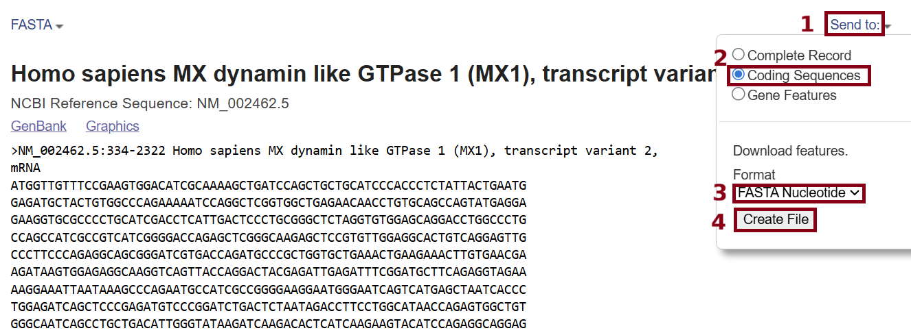
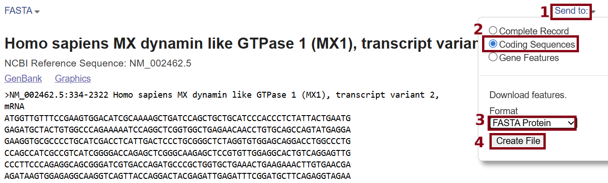
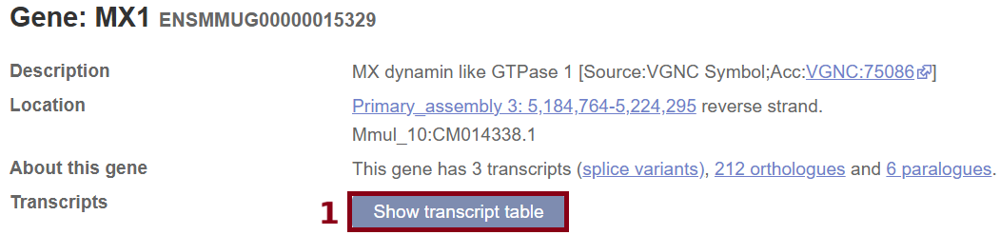
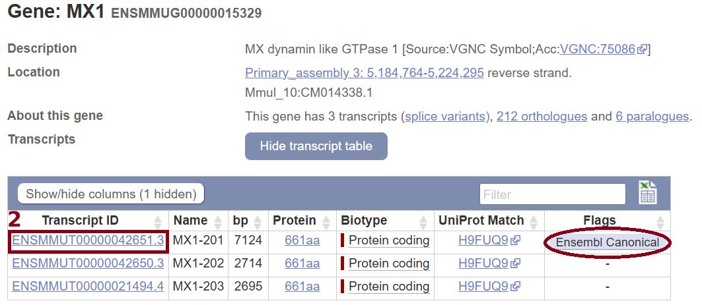
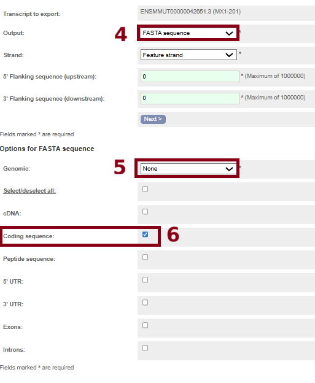
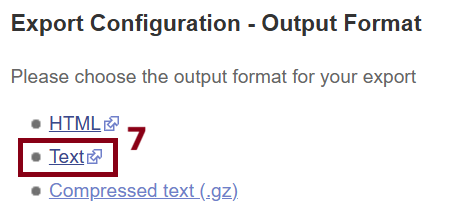
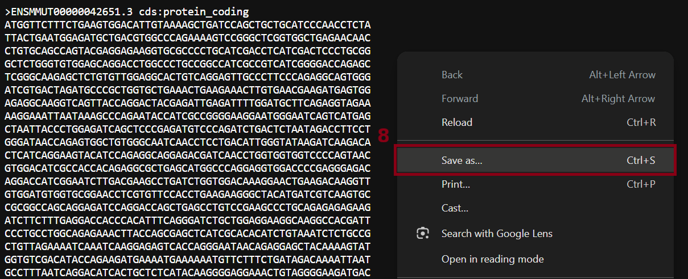
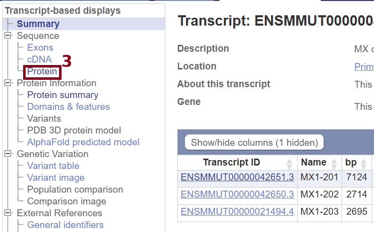
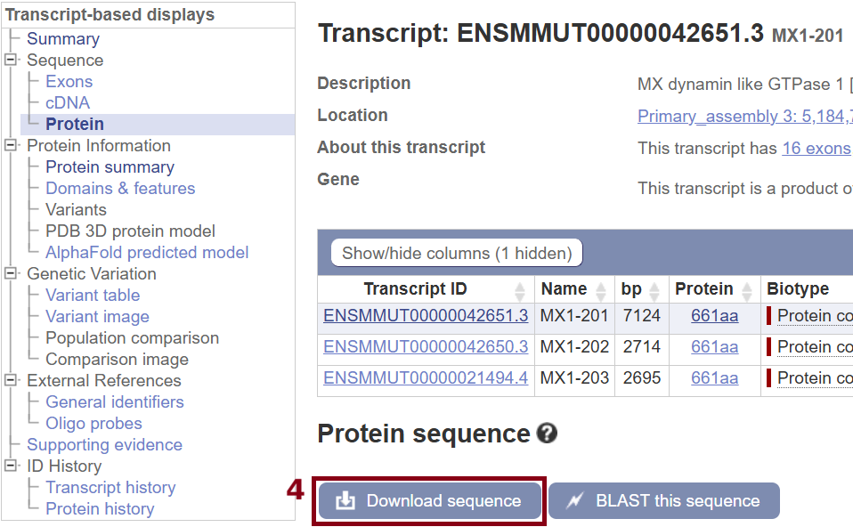
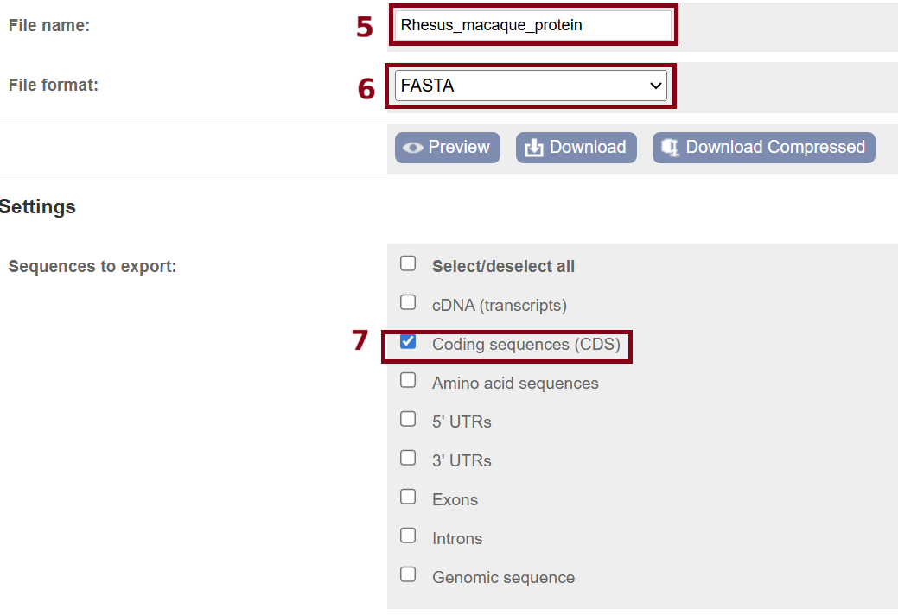

# Day 1 - data manipulation

## Introduction

During all practical sessions, we will be working with the same dataset (but processed at different stages): **12 sequences of the MX dynamin like GTPase 1 (MX1) protein-coding gene** that were described and analysed by [Hou et al. 2007](https://pubmed.ncbi.nlm.nih.gov/17467195/) (i.e., they refer to this dataset as "dataset 1"). Today, we will focus on the following steps:

* Downloading sequences in FASTA format using the web browser and the terminal.
* Downloading protein structures from the PDB and visualising them.
* Generating multiple sequence alignments (MSAs) using nucleotide, protein, and structural data.

Let's get started!

## Downloading data

### Command line

This year, we are going to be using an RStudio Server developed by [Stephen Lang](https://profiles.ucl.ac.uk/104417-stephen-lang) and [Werner Van Niekerk](https://profiles.ucl.ac.uk/60984-werner-van-niekerk) from [UCL's Advanced Research Computing Centre](https://www.ucl.ac.uk/advanced-research-c) -- thank you!! You can access the server by entering the following URL on your preferred web browser: https://biol0033.arc.ucl.ac.uk/

> [!IMPORTANT]
> If you have not yet read the step-by-step guidelines to access the server, please [access the tutorial via this link](../server/README.md) and make sure you understand the basics before proceeding with the practical.

Once you are in the server, please navigate to the `Terminal` tab and type the following:

```sh
# Create your working directory
mkdir my_session
# Move to your working directory
cd my_session
# Copy all the resources we will use
# today to your working directory
cp -R ~/biol0033-tutorial/day1 .
ls
```

Now, you have just copied everything that you will need for today's practical session on your own working directory called `my_session`. Let's get started with data download!

We have created two input files with all the information our python scripts will need to retrieve nucleotide and amino acid sequences from the `NCBI` and `ENSEMBL` databases and then save them in FASTA format with our preferred output filenames. These files start with two commented lines with information about the content of the file followed by as many tab-separated lines (i.e., each element in each row is separated by a tab, `\t`; there are four columns) as sequences we want to download. The information we require for each sequence is as follows:

* Accession number.
* Scientific name.
* Name that will be used in the FASTA header when saving the sequences in a FASTA file (i.e., text that comes after the `>`, which always precedes the sequence).
* Output file name, including the extension (i.e., we have chosen `.fasta`, although you will see that some researchers use `.fa` too).

Sequences for **human**, **orangutan**, **sheep**, **cow**, **dog**, **rat**, **pig**, **mouse**, **chicken**, and **rat** will be downloaded from the `NCBI` using the script [download_ncbi_sequences.py](scripts/download_ncbi_sequences.py). Sequences for **rhesus macaque** and **chimpanzee** will be downloaded from the `ENSEMBL` database using the script [download_ensembl_sequences.py](scripts/download_ensembl_sequences.py). The former script will be using file [`ncbi_sequences.tsv`](raw_data/ncbi_sequences.tsv) to retrieve information about the sequences to be downloaded, the latter will use file [`ensembl_sequences.tsv`](raw_data/ensembl_sequences.tsv). These scripts are to be executed as follows:

```txt
# NCBI
##> Only nucleotide data with STOP codons
<path_to_script>/scripts/download_ncbi_sequences.py <path_to_tsv>/ncbi_sequences.tsv <path_to_outdir>/data1/
##> Nucleotide data with STOP codons and amino acid data
<path_to_script>/scripts/download_ncbi_sequences.py <path_to_tsv>/ncbi_sequences.tsv <path_to_outdir>/data1/ --protein
##> Nucleotide data with STOP codons, without STOP codons, and amino acid data
<path_to_script>/scripts/download_ncbi_sequences.py <path_to_tsv>/ncbi_sequences.tsv <path_to_outdir>/data1/ --protein --rmstop

# ENSEMBL
##> Only nucleotide data with STOP codons
<path_to_script>/scripts/download_ensembl_sequences.py <path_to_tsv>/ensembl_sequences.tsv <path_to_outdir>/data1
##> Nucleotide data with STOP codons and amino acid data
<path_to_script>/scripts/download_ensembl_sequences.py <path_to_tsv>/ensembl_sequences.tsv <path_to_outdir>/data1/ --protein
##> Nucleotide data with STOP codons, without STOP codons, and amino acid data
<path_to_script>/scripts/download_ensembl_sequences.py <path_to_tsv>/ensembl_sequences.tsv <path_to_outdir>/data1/ --protein --rmstop

```

In order to run these scripts from the server, go back to the `Terminal` tab and run the following commands while making sure that your working directory is `my_session/day1`:

```sh
# Run from `my_session/day1`
# Change directories if you are not
# there yet

## Download sequences from NCBI
scripts/download_ensembl_sequences.py raw_data/ensembl_sequences.tsv raw_data/data1/ --protein --rmstop

## Download sequences from ENSEMBL
scripts/download_ncbi_sequences.py raw_data/ncbi_sequences.tsv raw_data/data1/ --protein --rmstop

# Now, move to `raw_data/data1` to
# check output files
cd raw_data/data1
ls
```

> [!IMPORTANT]
> If you are running these scripts outside campus, make sure you switch off the VPN. Otherwise, connection will be blocked and the scripts will not be able to retrieve the data from these two databases.

We will now separate these files in different directories (i.e., protein data, nucleotide data with STOP codons, nucleotide data without STOP codons). Then, we will concatenate the protein sequences in a unique file (file with multiple sequences unaligned) and do the same with all nucleotide sequences:

```sh
# Run from my_session/day1/raw_data/data1
# Change directories if you are not
# there yet

# Create individual directories for
# each data type
mkdir nuc_stop
mv *stopcod* nuc_stop
mkdir prot
mv *protein* prot
mkdir nuc
mv *fasta nuc

# Create one file with all
# nucleotide sequences and another
# with all protein sequences
##> NUC
count=0
for i in nuc/*fasta
do
count=$(( count + 1 ))
echo Adding sequence in file $i to \"unaln_nuc.fasta\"
if [[ $count -eq 1 ]]
then
cat $i > unaln_nuc.fasta
else
printf "\n" >> unaln_nuc.fasta
cat $i >> unaln_nuc.fasta
fi
done
##> PROT
count=0
for i in prot/*fasta
do
count=$(( count + 1 ))
echo Adding sequence in file $i to \"unaln_prot.fasta\"
if [[ $count -eq 1 ]]
then
cat $i > unaln_prot.fasta
else
printf "\n" >> unaln_prot.fasta
cat $i >> unaln_prot.fasta
fi
done

# Check that we have all sequences in both files
grep '>' unaln_nuc.fasta
grep '>' unaln_prot.fasta
```

Congratulations, you have now downloaded all sequence data and generated files with multiple sequences for both nucleotide and protein!

Now, you can explore the files that have been downloaded and saved in `raw_data/data1` as well as the files you have generated -- remember that you can click the filename on the bottom right panel and the file will appear on the top left panel! If you want to download files to your PC, you will need to click button `More` on the bottom right panel followed by `Export...`. Then, you can choose the location on your PC where you want a specific file to be saved. You have more tips about uploading and downloading files to/from the server in the [README.md file in the `server` directory](../server/README.md#uploading-files-to-the-server).

The next subsection will teach you how you could have downloaded sequences manually -- this step is important because, without knowing which buttons you need to click on the NCBI/ENSEMBL websites or which sections data are archived... You cannot write your script! If you are already familiar with these steps, you can then continue with the next task: [generating MSAs with both nucleotide and protein data!](README.md#nucleotide-and-protein-sequence-alignments)

<details>
<summary><b>[[ Click here to learn how to use the web browser for data download ]]</b></summary>
<br>

### Web browser

We will use the list of accession numbers they provided in the "Materials and Methods" section to download the relevant sequences for 12 different animals:

* Human, *Homo sapiens*, Mx1 (GenBank accession no: NM_002462). Downloaded from [the `NCBI` website using this link](https://www.ncbi.nlm.nih.gov/nuccore/NM_002462.5?from=334&to=2322&report=fasta).
* Rhesus macaque, *Macaca mulata*, Mx1 (Ensembl:ENSMMUG00000015329). Downloaded from [the `ENSEMBL` website using this link](http://www.ensembl.org/Macaca_mulatta/Gene/Summary?db=core;g=ENSMMUG00000015329;r=3:5184764-5224295).
* Chimpanzee, *Pan troglodites*, Mx1 (Ensembl:ENSPTRG00000013927). Downloaded from [the `ENSEMBL` website using this link](http://www.ensembl.org/Pan_troglodytes/Gene/Summary?db=core;g=ENSPTRG00000013927;r=21:27867000-27965931).
* Orangutan, *Pongo abeli*, cDNA from clone DKFZp469O2020, "note: myxovirus resistance protein 1 (Homo sapiens)" (Gen-Bank accession no: CR860897). Downloaded from [the `NCBI` website using this link](https://www.ncbi.nlm.nih.gov/nuccore/CR860897.1?from=351&to=2339&report=fasta).
* Sheep, *Ovis aries*, Mx homologue (GenBank accession no:X66093). Downloaded from [the `NCBI` website using this link](https://www.ncbi.nlm.nih.gov/nuccore/X66093.1?from=72&to=2036&report=fasta).
* Cow, *Bos taurus*, Mx1 (GenBank accession no: NM_173940). Downloaded from [the `NCBI` website using this link](https://www.ncbi.nlm.nih.gov/nuccore/NM_173940.2?from=99&to=2045&report=fasta).
* Dog, *Canis familiaris*, Mx1 (Gen-Bank accession no: AF239823). Downloaded from [the `NCBI` website using this link](https://www.ncbi.nlm.nih.gov/nuccore/AF239823.1?from=116&to=2089&report=fasta).
* Rat, *Rattus norvegicus*, Mx1 (GenBank accession no:BC099784). Downloaded from [the `NCBI` website using this link](https://www.ncbi.nlm.nih.gov/nuccore/BC099784.1?from=309&to=2267&report=fasta).
* Pig, *Sus scrofa*, Mx1 (GenBank accession no: AB164037). Downloaded from [the `NCBI` website using this link](https://www.ncbi.nlm.nih.gov/nuccore/AB164037.1?from=101&to=2089&report=fasta).
* Mouse, *Mus musculus* (GenBank accession no: NM_010846). Downloaded from [the `NCBI` website using this link](https://www.ncbi.nlm.nih.gov/nuccore/NM_010846.1?from=214&to=2109&report=fasta).
* Chicken, *Gallus gallus*, Mx1 (GenBank accession no: ~NM_204069~ **NOTE: They had a typo in their paper. This sequence is a frog, *Xenopus tropicalis*. The accession no for the chicken is NM_204609.1**). Downloaded from [the `NCBI` website using this link](https://www.ncbi.nlm.nih.gov/nuccore/NM_204609.1?from=141&to=2258).
* Duck, *Anas platyrhynchos*, clone 13, Mx protein (GenBank accession no:Z21549). Downloaded from [the `NCBI` website using this link](https://www.ncbi.nlm.nih.gov/nuccore/Z21549.1?from=61&to=2226).

We will now learn how to download sequence data depending on whether you are using `ENSEMBL` or `NCBI`:

#### NCBI

Please click the links above to download MX1 sequences for **human**, **orangutan**, **sheep**, **cow**, **dog**, **rat**, **pig**, **mouse**, **chicken**, and **rat**. Then, please follow the steps described in the figure below:

> NUCLEOTIDE DATA

<p align="center">

</p>

> PROTEIN DATA

<p align="center">

</p>

Before downloading the sequence data, create a directory called `data1`, where you will save all the sequence files. Then, go back to the web browser, and click `Send to:`, then select `Coding Sequencecs`. To download nucleotide data, please select `FASTA nucleotide` under "Format", then click `Create File` and modify the file to read `<name>_stopcod.fasta` (see below). To download protein sequences, do the same but now select `FASTA protein` instead and save the file as `<name>_protein.fasta`. The full filenames for each sequence are given below:

* **Homo sapiens** (NM_002462): `Human_stopcod.fasta` and `Human_protein.fasta`.
* **Pongo abeli** (CR860897): `Orangutan_stopcod.fasta` and `Oranguatan_protein.fasta`.
* **Ovis aries** (X66093): `Sheep_stopcod.fasta` and `Sheep_protein.fasta`.
* **Bos taurus** (NM_173940): `Cow_stopcod.fasta` and `Cow_protein.fasta`.
* **Canis familiaris** (AF239823): `Dog_stopcod.fasta` and `Dog_protein.fasta`.
* **Rattus norvegicus** (BC099784): `Rat_stopcod.fasta` and `Rat_protein.fasta`.
* **Sus scrofa** (AB164037): `Pig_stopcod.fasta` and `Pig_protein.fasta`.
* **Mus musculus** (NM_010846): `Mouse_stopcod.fasta` and `Mouse_protein.fasta`.
* **Gallus gallus** (NM_204609): `Chicken_stopcod.fasta` and `Chicken_protein.fasta`.
* **Anas platyrhynchos** (Z21549): `Duck_stopcod.fasta` and `Duck_protein.fasta`.

If you open these files using your preferred text editor (e.g., Notepad++, VSC, vim, etc.), you will see that all these sequences have STOP codons (either `TAA`, `TAG`, or `TGA`), which we need to remove prior to sequence alignment. We will also change all the FASTA headers so that only the taxon name is kept (e.g., `>Human`, `>Orangutan`, etc.). Once you remove the last three nucleotides from the sequences that are STOP codons and update the FASTA header, then please save them as follows:

* **Homo sapiens** (NM_002462): `Human.fasta`.
* **Pongo abeli** (CR860897): `Orangutan.fasta`.
* **Ovis aries** (X66093): `Sheep.fasta`.
* **Bos taurus** (NM_173940): `Cow.fasta`.
* **Canis familiaris** (AF239823): `Dog.fasta`.
* **Rattus norvegicus** (BC099784): `Rat.fasta`.
* **Sus scrofa** (AB164037): `Pig.fasta`.
* **Mus musculus** (NM_010846): `Mouse.fasta`.
* **Gallus gallus** (NM_204609): `Chicken.fasta`.
* **Anas platyrhynchos** (Z21549): `Duck.fasta`.

#### ENSEMBL

Please click the links above to download MX1 sequences for **rhesus macaque** and **chimpanzee**. Then, please follow the steps described in the figure below:

> NUCLEOTIDE DATA

<p align="center">

</p>
<p align="center">

</p>
<p align="center">

</p>
<p align="center">

</p>
<p align="center">

</p>
<p align="center">

</p>

> PROTEIN DATA

<p align="center">

</p>
<p align="center">

</p>
<p align="center">

</p>
<p align="center">

</p>
<p align="center">

</p>

You will save all the sequence files in directory `data1`, which you should have already created. To download sequence data, click `Show transcript table` and look for the `Ensembl Canonical` transcript: this is the transcript you want! Then, select the transcript ID corresponding to the canonical sequence and you will see how the "Summary" section gets updated. Once this happens, you can right-click `Protein` (step 3 to download protein data, see pictures above) and open the link in a new tab (we will continue with protein data later!). Now, go back to the first tab you opened and click `Export data` (step 3 to download nucleotide data, see pictures above). Now, please make sure you keep the options shown as steps 4, 5, and 6 in pictures above (i.e., `Fasta sequence`, `None` and tick the box for `Coding sequence`), then click `Next>`. The next screen will ask about the output format: select `Text` (step 7) and a new window will open with the sequence data!  Now, right-click and select `Save as...`, then make sure you save the file as `<name>_stopcod.fasta` (see below). To download protein sequences, go back to the second tab you had previously opened and click `Download sequence` (step 4 to download protein data as shown above). Now, please make sure you keep the options shown as steps 5, 6, and 7 in pictures above (i.e., the name of the taxon followed by "_protein", `FASTA`, and tick the box for `Coding sequences (CDS)`), then click `Download` -- make sure you update the filename to `<name>_protein.fasta`! The full filenames for each sequence are given below:

* **Macaca mulata** (Ensembl:ENSMMUG00000015329): `Rhesus_macaque_stopcod.fasta` and `Rhesus_macaque_protein.fasta`.
* **Pan troglodites** (Ensembl:ENSPTRG00000013927): `Chimpanzee_stopcod.fasta` and `Chimpanzee_protein.fasta`.

If you open these files using your preferred text editor (e.g., Notepad++, VSC, vim, etc.), you will see that all these sequences have STOP codons (either `TAA`, `TAG`, or `TGA`), which we need to remove prior to sequence alignment. We will also change all the FASTA headers so that only the taxon name is kept (e.g., `>Rhesus_macaque`, `>Chimpanzee`). Once you remove the last three nucleotides from the sequences that are STOP codons and update the FASTA header, then please save them as follows:

* **Macaca mulata** (Ensembl:ENSMMUG00000015329): `Rhesus_macaque.fasta`.
* **Pan troglodites** (Ensembl:ENSPTRG00000013927): `Chimpanzee.fasta`.

Hope that these steps have helped you understand how we wrote the python scripts and... You are now ready to infer your sequence alignments!
</details>
<br>

## Nucleotide and protein sequence alignments

There are different software that you can use to align your sequences but, to keep this session within time, we shall focus on two of them: `MAFFT` and `Muscle5`.

### MAFFT

[`MAFFT` (Multiple Alignment using Fast Fourier Transform)](https://mafft.cbrc.jp/) ([Katoh & Standley 2013](https://pmc.ncbi.nlm.nih.gov/articles/PMC3603318/)) is a popular aligner that can be used for inferring MSAs. Depending on the data that you have, one of the different `MAFFT` variants may be more suitable for inferring your MSA. If it is the first time you are using `MAFFT`, you should check the help manual on the terminal by typing the following command:

```sh
# Type the following on the terminal
mafft --help
```

Now, you should see the following texted printed on your screen:

```txt
------------------------------------------------------------------------------
  MAFFT v7.490 (2021/Oct/30)
  https://mafft.cbrc.jp/alignment/software/
  MBE 30:772-780 (2013), NAR 30:3059-3066 (2002)
------------------------------------------------------------------------------
High speed:
  % mafft in > out
  % mafft --retree 1 in > out (fast)

High accuracy (for <~200 sequences x <~2,000 aa/nt):
  % mafft --maxiterate 1000 --localpair  in > out (% linsi in > out is also ok)
  % mafft --maxiterate 1000 --genafpair  in > out (% einsi in > out)
  % mafft --maxiterate 1000 --globalpair in > out (% ginsi in > out)

If unsure which option to use:
  % mafft --auto in > out

--op # :         Gap opening penalty, default: 1.53
--ep # :         Offset (works like gap extension penalty), default: 0.0
--maxiterate # : Maximum number of iterative refinement, default: 0
--clustalout :   Output: clustal format, default: fasta
--reorder :      Outorder: aligned, default: input order
--quiet :        Do not report progress
--thread # :     Number of threads (if unsure, --thread -1)
--dash :         Add structural information (Rozewicki et al, submitted)
```

Given that our sequences are quite small, we could use `mafft-linsi` to carry out a local pair, iterative refinement. Nevertheless, we will use `mafft --auto` so that the program can decide the best algorithm to use based on our data. We will run one analysis using the default settings:

```sh
# Run from my_session/day1/raw_data/data1
# Change directories if you are not
# there yet

# Run MAFFT for nucleotide data and
# protein data
##> NOTE: 2> >(tee log_mafft_<data_type>_aln.txt >&2)
##>       helps redirect screen output to a log file
##>       while also seeing it on screen
mafft --auto unaln_nuc.fasta > aln_nuc_raw_mafft.fasta 2> >(tee log_mafft_nuc_aln.txt >&2)
mafft --auto unaln_prot.fasta > aln_prot_raw_mafft.fasta 2> >(tee log_mafft_prot_aln.txt >&2)
```

It looks like the best strategy for aligning both nucleotide and protein sequences was `mafft-linsi`:

```txt
Strategy:
 L-INS-i (Probably most accurate, very slow)
 Iterative refinement method (<16) with LOCAL pairwise alignment information
```

> [!NOTE]
> Later, you can run different versions of `MAFFT` or `mafft-linsi` with different parameters to see how different penalty gaps or number of iterative refinements can change the way the sequences are aligned!

Once you are happy with your MSAs, you can use an in-house PERL script to reformat the alignments so that the sequences are written in a unique line after the FASTA header:

```sh
# Run from my_session/day1/raw_data/data1
# Change directories if you are not
# there yet

# Create a directory for alignments
mkdir ../../aln

# Run the in-house PERL script and save
# a one-line MSA in dir `aln`
for i in *raw_mafft*fasta
do
name=$( echo $i | sed 's/\.fasta//' )
name2=$( echo $name | sed 's/\_raw\_mafft//' )
../../scripts/one_line_fasta.pl $i 
mv $name"_one_line.fa" ../../aln/$name2"_mafft.fasta"
done
```

Now, you can learn how to use `Muscle5` (version 5.3)!

### Muscle5

As it was the case with `MAFFT`, there are different variants of `Muscle5` depending on the algorithm being used for inferring MSAs. You can read more about the different options you can enable by running the following command on the terminal:

```sh
# Type the following on the terminal
muscle --help
```

You will see the following:

```txt
muscle 5.3.linux64 [d9725ac]  30.8Gb RAM, 8 cores
Built Nov 10 2024 22:58:59
(C) Copyright 2004-2021 Robert C. Edgar.
https://drive5.com

Align FASTA input, write aligned FASTA (AFA) output:
    muscle -align input.fa -output aln.afa

Align large input using Super5 algorithm if -align is too expensive,
typically needed with more than a few hundred sequences:
    muscle -super5 input.fa -output aln.afa

Single replicate alignment:
    muscle -align input.fa -perm PERM -perturb SEED -output aln.afa
    muscle -super5 input.fa -perm PERM -perturb SEED -output aln.afa
        PERM is guide tree permutation none, abc, acb, bca (default none).
        SEED is perturbation seed 0, 1, 2... (default 0 = don't perturb).

Ensemble of replicate alignments, output in Ensemble FASTA (EFA) format,
EFA has one aligned FASTA for each replicate with header line "<PERM.SEED":
Note -super5 does not support .efa output, to get an ensemble you can
  (1) run several times with different -perm and -perturb options, or
  (2) use -perm all, then four output files will be generated, one for
        each guide tree permutation (use @ in the output filename).
    muscle -align input.fa -stratified -output stratified_ensemble.efa
    muscle -align input.fa -diversified -output diversified_ensemble.afa

    -replicates N
        Number of replicates, defaults 4, 100, 100 for stratified,
          diversified, resampled. With -stratified there is one
          replicate per guide tree permutation, total is 4 x N.

Generate resampled ensemble from existing ensemble by sampling columns
with replacement:
    muscle -resample ensemble.efa -output resampled.efa

    -maxgapfract F
       Maximum fraction of gaps in a column (F=0..1, default 0.5).

    -minconf CC
       Minimum column confidence (CC=0..1, default 0.5).

If ensemble output filename has @, then one FASTA file is generated
for each replicate where @ is replaced by perm.s, otherwise all replicates
are written to one EFA file.

Calculate disperson of an ensemble:
    muscle -disperse ensemble.efa

Extract replicate with highest total CC (diversified input recommended):
    muscle -maxcc ensemble.efa -output maxcc.afa

Extract aligned FASTA files from EFA file:
    muscle -efa_explode ensemble.efa

Convert FASTA to EFA, input has one filename per line:
    muscle -fa2efa filenames.txt -output ensemble.efa

Update ensemble by adding two sequences of digits to each replicate, digits
are column confidence (CC) values, e.g. "73" means CC=0.73, "++" is CC=1.0:
    muscle -addconfseq ensemble.efa -output ensemble_cc.efa

Calculate letter confidence (LC) values, -ref specifies the alignment to
compare against the ensemble (e.g. from -maxcc), output is in aligned
FASTA format with LC values 0, 1 ... 9 instead of letters:
    muscle -letterconf ensemble.efa -ref aln.afa -output letterconf.afa

    -html aln.html
        Alignment colored by LC in HTML format.

    -jalview aln.features
        Jalview feature file with LC values and colors.

More documentation at:
    https://drive5.com/muscle
```

We will use the [`PPP` algorithm](https://drive5.com/muscle5/manual/cmd_align.html) and the [`super5`]algorithm(https://drive5.com/muscle5/manual/cmd_super5.html) to infer both alignments, and then we will compare the differences:

```sh
# Run from my_session/day1/raw_data/data1
# Change directories if you are not
# there yet

# Run Muscle5.3 for nucleotide data and
# protein data
muscle -super5 unaln_nuc.fasta -output aln_nuc_raw_muscle_super5.fasta > log_musclesuper5_nuc_aln.txt 
muscle -super5 unaln_prot.fasta -output aln_prot_raw_muscle_super5.fasta > log_musclesuper5_prot_aln.txt 
muscle -align unaln_nuc.fasta -output aln_nuc_raw_muscle_ppp.fasta > log_muscleppp_nuc_aln.txt 
muscle -align unaln_prot.fasta -output aln_prot_raw_muscle_ppp.fasta > log_muscleppp_prot_aln.txt 
```

Now, we will generate our one-line MSAs using our in-house PERL script:

```sh
# Run from my_session/day1/raw_data/data1
# Change directories if you are not
# there yet

# Run the in-house PERL script and save
# one-line MSAs in dir `aln`
for i in *raw_muscle*fasta
do
name=$( echo $i | sed 's/\.fasta//' )
name2=$( echo $name | sed 's/\_raw\_muscle//' )
../../scripts/one_line_fasta.pl $i 
mv $name"_one_line.fa" ../../aln/$name2"_muscle.fasta"
done

# Check all the alignments we have inferred
cd ../../aln
ls
```

To compare the different alignments, we will use one of the tools available as part of [`BAli-Phy`](https://github.com/bredelings/BAli-Phy/tree/master), `alignment-info`, to summarise the content of each alignment:

```sh
# Run from my_session/day1/aln
# Change directories if you are not
# there yet

# Create directory for log info
mkdir log_info

# Run `alignment-info`
../scripts/alignment-info/bin/alignment-info aln_nuc_mafft.fasta > log_info/log_info_nuc_mafft.txt
../scripts/alignment-info/bin/alignment-info aln_nuc_ppp_muscle.fasta > log_info/log_info_nuc_ppp_muscle.txt
../scripts/alignment-info/bin/alignment-info aln_nuc_super5_muscle.fasta > log_info/log_info_nuc_super5_muscle.txt
../scripts/alignment-info/bin/alignment-info aln_prot_mafft.fasta >log_info/log_info_prot_mafft.txt
../scripts/alignment-info/bin/alignment-info aln_prot_ppp_muscle.fasta > log_info/log_info_prot_ppp_muscle.txt
../scripts/alignment-info/bin/alignment-info aln_prot_super5_muscle.fasta > log_info/log_info_prot_super5_muscle.txt
```

You can compare metrics such as gaps, indels, minimum sequence identity, sequence length, character frequencies, etc. Then, you can also use [`AliView`](https://ormbunkar.se/aliview/#DOWNLOAD) to visually compare your alignments! You can download the MSAs on your PC and load them on this program.

> [!IMPORTANT]
> What do you think about using different aligners? And the different output you obtained? Which alignment would you prefer and why?

After discussing the quality of your nucleotide and protein alignments, you are ready to start your journey with structural data! The next sections will show you how to download structural data and how to generate structure-based alignments!

## Download structural data

## Structure-based sequence alignment
