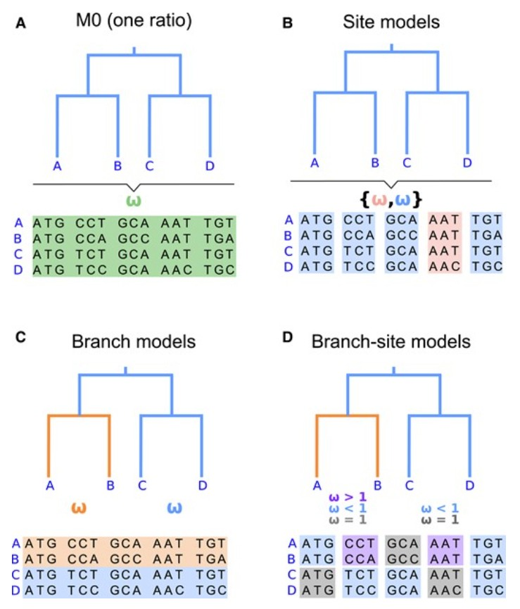
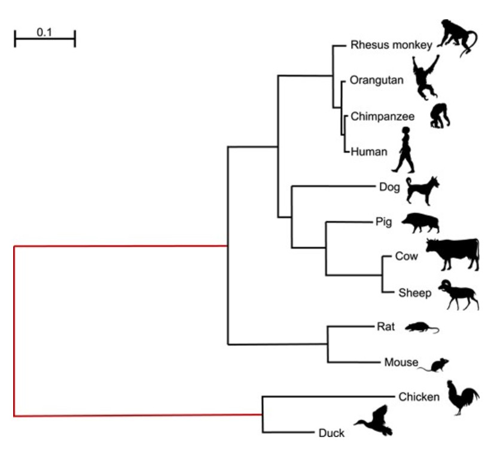
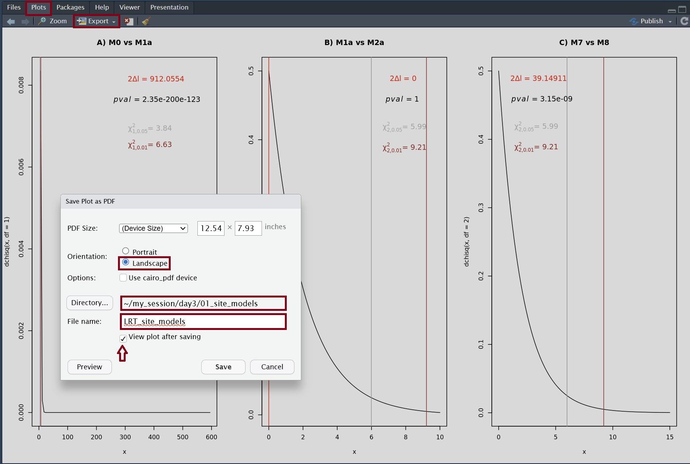
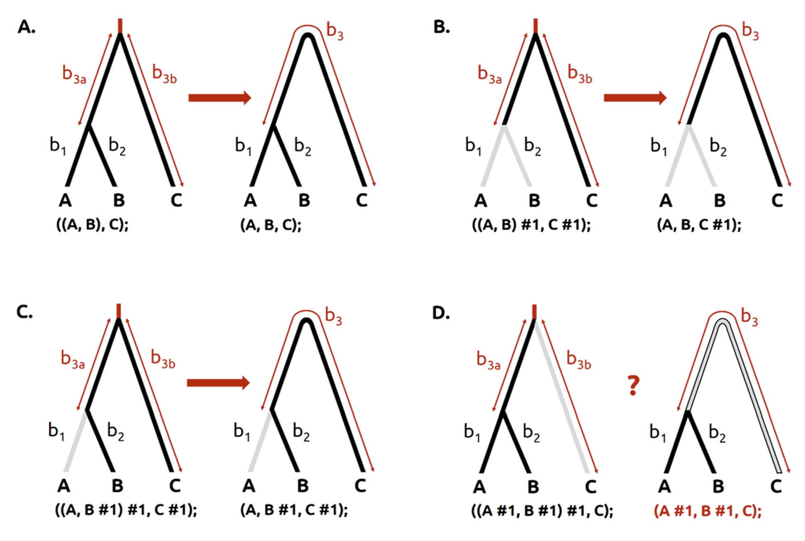

# Day 3 - testing for positive selection

> [!IMPORTANT]
> **Disclaimer**: this tutorial is based on the article **Beginner's Guide on the Use of PAML to Detect Positive Selection** ([Álvarez-Carretero et al. 2023](https://doi.org/10.1093/molbev/msad041)). Consequently, you may find similarities between the aforementioned paper and its [step-by-step protocol](https://github.com/abacus-gene/paml-tutorial/tree/main/positive-selection) when going through this practical session.

## Introduction

In the theoretical lectures, you have learnt that the ratio between nonsynonymous and synonymous substitution rates, $\omega=dN/dS$, has been widely used as a model parameter to measure the effect of natural selection on protein-coding genes ([Kimura 1977](https://www.nature.com/articles/267275a0), [Miyaga & Yasunaga 1980](https://link.springer.com/article/10.1007/BF01732067)). While synonymous mutations (also known as "silent" mutations) do not change the amino acid, nonsynonymous mutations (also known as replacement mutations) do. The latter mutations may often be deleterious and purged from the population by natural selection, resulting in reduced nonsynonymous substitution rate ($d_{N}$). **The $\omega$ ratio measures the direction and magnitude of such selection on nonsynonymous mutations**.

Once we estimate $\omega$, we may be able to suggest one of the following:

* The analysed protein-coding gene is **under positive (or diversifying) selection (or adaptive evolution)**, if $\omega>1$. Beneficial nonsynonymous mutations are favoured and quickly fix in the population.
* The analysed protein-coding gene shows **no evidence for selection**, if $\omega=1$. In such a case, most mutations are neither beneficial nor detrimental (i.e., the mutation makes no fitness difference), thus often related to neutral mutations.
* The analysed protein-coding gene may be **under negative (or purifying) selection**, if $\omega<1$.

> [!IMPORTANT]
> After running `CODEML`, we will run **Likelihood Ratio Tests** (LRTs) to assess the fitness of nested models. In some model comparisons, we will see that some models in which $\omega=1$ is fixed to account for sites that are nearly neutral or under a weak constraint become our null models.

As every functional protein has some structural constraints, the $\omega$ ratio average over the whole protein sequence is often less than 1, even if positive selection operates at some sites or over certain time intervals. Thus, statistical tests have been designed to detect positive selection that targets only a small subset of the amino acid residues or affects a limited time interval, leading to the development of **site** models and **branch** models, which subsequently led to the implementation of **branch-site** models.

During this practical session, we will learn how to test for positive selection under the codon models implemented in the maximum-likelihood program **`CODEML`**, part of the `PAML` software ([Yang 2007](https://doi.org/10.1093/molbev/msm088)). Particularly, we shall focus on the following analyses:

* Calculating $\omega$ (i.e., nonsynonymous/synonymous ratio $d_{N}/d_{S}$) as a measure of average selective pressure on the protein-coding gene we are analysing (i.e., Mx gene) under the **homogeneous model**, which assumes one $\omega$ for all sites and branches.
* Detecting positive selection affecting a **subset of sites** in the protein-coding gene evolving under positive selection (**site test**).
* Detecting a **specific branch or branches** of a phylogeny evolving under positive selection (**branch test**).
* Detecting a **subset of sites for particular branches** of a phylogeny evolving under positive selection (**branch-site test**).

> [!IMPORTANT]
> After running `CODEML`, we will run **Likelihood Ratio Tests** (LRTs) to assess the fitness of nested models. The homogeneous model will be our null hypothesis in some of our tests for positive selection.

In order to start our analyses with `CODEML`, we will need two important input files: a **fixed tree topology** and a **sequence alignment**. During days 1 and 2, we have learnt how to infer both, so... we have everything we need to get started!

## Using `PAML` program `CODEML` to detect positive selection

### Understanding the control file

To run any `PAML` program, we need a control file. In other words, instead of having all options passed through a command, all variables and the corresponding options are specified in a text file that the program reads. Below, you can find an example of control file to run `CODEML` that you can always use as a template (options have been kept as "flags", which should be replaced with adequate values):

```txt
* [ INPUT/OUTPUT FILES ]
      seqfile = ALN            * Path to the sequence alignment file
     treefile = TREE           * Path to the tree file
      outfile = OUT            * Path to the output file
   
* [ SCREEN OUTPUT ]
        noisy = 3              * How much information you want to see on the screen
      verbose = 1              * Detailed output file

* [ TYPE OF SEQUENCE DATA ]
      seqtype = 1              * Data type
        ndata = NDAT           * Number of alignment blocks / partitions
        icode = 0              * Genetic code 
    cleandata = 0              * Remove sites with ambiguity data?

* [ SUBSTITUTION MODEL ]
        model = CODMOD         * Models for ω varying across lineages
      NSsites = NSSIT          * Models for ω varying across sites
    CodonFreq = CODFREQ        * Codon frequencies
      estFreq = ESTFREQ        * Use observed freqs or estimate freqs by ML
    fix_omega = FIXOME         * Estimate or fix omega
        omega = INITOME        * Initial or fixed omega
        clock = CLOCK          * Clock model
```

Let's explain each variable and their options!

* Variables related to input/output files:
  * `seqfile`: flag `ALN` needs to be replaced with the name of the input file with the sequence alignment (if available within the same directory where this control file is saved) or the path to such file. When the latter, you can use either absolute or relative paths to the input sequence file.
  * `treefile`: flag `TREE` needs to be replaced with the name of the input tree file (if available within the same directory where this control file is saved) or the path to such file. When the latter, you can use either absolute or relative paths to the input tree file.
  * `outfile`: flag `OUT` needs to be replaced with the name of the output file (if you want to save it in the same directory where this control file is saved) with relevant information about the analysis. If you want to save this file elsewhere, you can use either absolute or relative paths to do so.
* Variables related to screen and output details:
  * `noisy` and `verbose`: these are two variables that control how much information you want to see printed on the screen and on your output file, respectively. To see a moderate amount of detail printed on the screen, you may choose `noisy = 3`(possible options: `0` to `3`). If you want to obtain a very detailed output, you should choose `verbose = 1`. Choose `verbose = 0`  for a much more concise output file.
* Variables related to the input data type:
  * `seqtype`: this variable indicates the data type. When running `CODEML`, you should always use `seqtype = 1` as you must use codon data. The other options are available for other `PAML` programs that enable the usage of nucleotide data (`seqtype = 0`) or amino acid data (`seqtype = 2`).
  * `ndata`: flag `NDAT` should be replaced with the number of alignment blocks (or partitions) that you have in your input sequence alignment. We are only analysing one gene in this tutorial, so `NDAT` should be replaced with `1`.
  * `icode`: this variable related to the genetic code. When setting `icode = 0`, we are specifying the standard genetic code. All genetic codes that can be specified in `CODEML` are enabled using the following options (see [`transl_table` 1 to 11 of GENEBANK](https://www.ncbi.nlm.nih.gov/Taxonomy/Utils/wprintgc.cgi#SG1) for more details on each of the below):
    * `0`: standard.
    * `1`: mammalian mt.
    * `2`: yeast mt.
    * `3`: mold mt.
    * `4`: invertebrate mt.
    * `5`: ciliate nuclear
    * `6`: echinoderm mt.
    * `7`: euplotid mt.
    * `8`: alternative yeast nu.
    * `9`: ascidian mt.
    * `10`: blepharisma nu.
  * `cleandata`: this variable can be used to decide whether sites with ambiguity data and alignment gaps should be kept (`cleandata = 0`) or removed (`cleandata = 1`). It is recommended that all alignment filtering and trimming takes place prior to running `CODEML`, thus encouraging users to specify `cleandata = 0`. More recommendations about this step can be found in sections `Alignment, sequence data file, and tree file" and "Gene tree versus species tree" in the [Supplementary Material of Álvarez-Carretero et al. 2023](https://oup.silverchair-cdn.com/oup/backfile/Content_public/Journal/mbe/40/4/10.1093_molbev_msad041/2/msad041_supplementary_data.pdf?Expires=1774651114&Signature=phKHDR~EitWyE~wSuNTBeR1jhwChp3q7E5SFRBv~u9Z1uVP~Q7gUJNs-4vRJxxYdgg7uBidCOFxKOotoLJeJMmFdqTs3AC3VLROgn~mSVgrICce7C6OOE-LqS4Dh3uM9NLhSKEOqtxKMfaTpcgTNXTHW2woP9WHwIP2i-QVV~W9z96ZuDFBg6HhqT3xFyyYmhI2JNDe~L8TGuSLDjI-k2kACz3GBt46-GYSS9dPJ75GexYd-hJ1G-s4Ravm329wSba4UmYdyeNHCV0QB4GKrAx1tIRoE6NOdWMS-4YDJuMdAyq2IdIvOK-xJF2MFFgx5vB5Ip-HJqAWAAlPIFO4RXw__&Key-Pair-Id=APKAIE5G5CRDK6RD3PGA).
* Variables related to specifying the codon model:
  * `model` and `NSsites`: these two variables can jointly specify which model is being enabled:
    * homogeneous model: `model = 0` and `NSsites = 0`.
    * Site models: `model = 0` and `NSsites` can equal `1`, `2`, `7`, or `8` (depending on the site model under which the analysis takes place).
    * Branch model: `model = 2` and `NSsites = 0`.
    * Branch-site model: `model = 2` and `NSsites = 2`.
    <p align="center">
    
    </p>

    > Figure 1. Illustration of four different types of models implemented in `CODEML`, from Figure 3 in [Álvarez-Carretero et al. 2023](https://doi.org/10.1093/molbev/msad041). (A) homogeneous evolutionary pressure throughout the history of the gene (`M0`: one ratio, with one $\omega$ ratio for all sites and branches, specified as `model = 0` and `NSsites = 0`); (B) heterogeneous pressure across codons (site models: `model = 0` and `NSsites = 1, 2, 7, 8`, etc.); (C) heterogeneous pressure across branches of a tree but homogeneous across codons (branch model: `model = 2` and `NSsites = 0`); and (D) heterogeneous pressure across sites and branches (branch-site model: `model = 2` and `NSsites = 2`).
  * `CodonFreq`: the codon frequencies can be set to either be equal or variable to account for codon usage bias. If you choose `verbose = 1`, the program will print out the codon frequencies expected under the latter models, calculated using the observed nucleotide frequencies in the dataset. The options accepted for variable `CodonFreq` are as follows:
    * `0`: codon frequencies are assumed to be equal (i.e., 1/61 each). Number of free parameters for standard genetic code: 0.
    * `1`: "F1X4". Codon frequencies are calculated from the average of nucleotide frequencies. Number of free parameters for standard genetic code: 3.
    * `2`: "F3X4". Codon frequencies are calculated from the average nucleotide frequencies at the three codon positions. Number of free parameters for standard genetic code: 9.
    * `3`: codon frequencies are used as free parameters. Number of free parameters for standard genetic code: 60.
    * `4`: "F1x4MG". This option uses one set of base frequencies for all three codon positions just like F1x4 but is implemented in the style of [Muse and Gaut (1994)](https://doi.org/10.1093/oxfordjournals.molbev.a040152): the substitution rate from codon _i_ to codon _j_ is proportional to the frequency of the target nucleotide rather than the frequency of the target codon. Number of free parameters for standard genetic code: 3.
    * `5`: "F3X4MG". This option calculates codon frequencies from the average nucleotide frequencies at the three codon positions just like F3x4 but is implemented in the style of [Muse and Gaut (1994)](https://doi.org/10.1093/oxfordjournals.molbev.a040152): the substitution rate from codon _i_ to codon _j_ is proportional to the frequency of the target nucleotide rather than the frequency of the target codon. Number of free parameters for standard genetic code: 9.
    * `6`: "FMutSel0". This is a special case of "FMutSel" (see below) that assigns the same fitness value for all synonymous codons, so that only 19 (= 20 – 1) amino acid fitness parameters are used. This model assumes that the amino acid frequencies are determined by the functional requirements of the protein and, given the amino acid frequencies, the relative frequencies of synonymous codons are determined solely by the mutational-bias parameters. Number of free parameters for standard genetic code: $\pi_{TCA}$ (3) + 19 AA frequencies.
    * `7`: "FMutSel". This setting assigns a fitness to every codon with 60 (= 61 – 1) codon fitness parameters for the standard genetic code. Number of free parameters for standard genetic code: $\pi_{TCA}$ (3) + 60 codon frequencies.
  * `estFreq`: if the frequency/fitness parameters are estimated by maximum likelihood from the data, then `estFreq = 1`. Otherwise, `estFreq = 0` will enable their calculation using the observed frequencies in the data.
  * `fix_omega` and `omega`: depending on the mode assigned using variables `model`, `NSsites`, `CodonFreq`, and `estFreq`, we can decide whether to fix the $\omega$ ratio (`fix_omega = 1`) or estimate it (`fix_omega = 0`). If `fix_omega = 1`, the value of the $\omega$ ratio will fixed to the value passed to variable `omega`. If `fix_omega = 0`, the starting value of $\omega$ during ML estimation will be the value passed to variable `omega`.
  * `clock`: this variable will enable models concerning rate constancy or variation among lineages. When `clock = 0` is specified, there is no clock assumed, and thus rates are entirely free to vary from branch to branch (number of parameters: $2n-3$, where $n$ is the number of species in the sequence alignment and a binary tree is assumed). An unrooted tree should be used under this model. When `clock = 1`, the strict clock model is enabled, and thus all branches have the same rate (number of parameters: $n-1$, corresponding to the $n-1$ internal nodes in the binary tree). A test of the molecular clock assumption comparing these two assumptions should have a degree of freedom $d.f = n-2$. You can enable other types of clocks, but they are out of the scope of this protocol (if interested, please consult the [`PAML` Wiki](https://github.com/abacus-gene/paml/wiki/) for more details).

### Input sequence alignment and tree files

Now that you are more familiar with the settings you need to specify in the control file to run `CODEML`, let's focus on our input files: the sequence alignment and the tree file.

During day 1 and day 2, we ran all necessary steps to obtain our codon-aware sequence alignments:

* `aln_nuc_against_protsuper5.fasta`: unaligned nucleotide sequences were aligned against a protein alignment.
* `aln_nuc_against_protusalign.fasta`: unaligned nucleotide sequences were aligned against a structural alignment.

Due to time restrictions, we shall use only one of those alignments (`aln_nuc_against_protsuper5.fasta`). Nevertheless, you are more than free to repeat this tutorial using the other alignment too!

Please note that we will need to convert the FASTA-formatted sequence files to PHYLIP. There are many tools that can help you convert FASTA-formatted alignments into PHYLIP-formatted alignments, so please feel free to choose any of such tools (you can even write your own script if you want to!). To speed things up, you will find the sequence alignment in PHYLIP format inside `day3/inp_data`, which we have already prepared for you to save some time (see below when we start with the analyses!).

During day 2, we learnt how to infer the best-scoring maximum-likelihood tree with `IQ-TREE`. Today, we have learnt how to infer a phylogeny under a Bayesian approach with `MrBayes`. When inferring phylogenies using the alignment `aln_nuc_against_protsuper5.fasta`, we obtain the same **unrooted tree topology** (branch lengths may differ):

```txt
((((((Pig_Mx, (Sheep_Mx, Cow_Mx)), Dog_Mx), (Rhesus_macaque_Mx, (Orangutan_Mx, Human_Mx))), (Rat_Mx, Mouse_Mx)), Chimpanzee_Mx), Duck_Mx, Chicken_Mx);
```

If we were to root it by separating birds (duck and chicken) from mammals, we would obtain the following **rooted tree topology** in Newick format:

```txt
((((((Pig_Mx, (Sheep_Mx, Cow_Mx)), Dog_Mx), (Rhesus_macaque_Mx, (Orangutan_Mx, Human_Mx))), (Rat_Mx, Mouse_Mx)), Chimpanzee_Mx), (Duck_Mx, Chicken_Mx));
```

We can clearly see that the inferred topology of this **gene tree** (i.e., the Mx gene tree) is in conflict with the expected topology of the **species tree** (i.e., chimpanzee should cluster with the rest of primates):

<p align="center">

</p>

> Figure 2. Phylogenetic tree for ten mammals and two bird species, from Figure 1 in [Álvarez-Carretero et al. 2023](https://doi.org/10.1093/molbev/msad041). All silhouettes were obtained from images dedicated to the public domain, accessible via [Phylopic](https://www.phylopic.org/images/).

Mismatches between gene trees and species trees are not rare, and can be due to different scenarios:

* Compositional biases.
* Long-branch attraction.
* Model assumptions being violated.
* Systematic errors.
* Data filtering.
* And many more!

Under such a conflict, deciding whether fixing the species tree or the gene tree is not easy. The models used in tests for positive selection assume that the fixed tree topology represent the "true" evolutionary relationships of the sequences, and so one should use whichever tree is most likely to be correct. As discussed in section "Gene tree versus species tree" in the [Supplementary Material of Álvarez-Carretero et al. 2023](https://oup.silverchair-cdn.com/oup/backfile/Content_public/Journal/mbe/40/4/10.1093_molbev_msad041/2/msad041_supplementary_data.pdf?Expires=1774651114&Signature=phKHDR~EitWyE~wSuNTBeR1jhwChp3q7E5SFRBv~u9Z1uVP~Q7gUJNs-4vRJxxYdgg7uBidCOFxKOotoLJeJMmFdqTs3AC3VLROgn~mSVgrICce7C6OOE-LqS4Dh3uM9NLhSKEOqtxKMfaTpcgTNXTHW2woP9WHwIP2i-QVV~W9z96ZuDFBg6HhqT3xFyyYmhI2JNDe~L8TGuSLDjI-k2kACz3GBt46-GYSS9dPJ75GexYd-hJ1G-s4Ravm329wSba4UmYdyeNHCV0QB4GKrAx1tIRoE6NOdWMS-4YDJuMdAyq2IdIvOK-xJF2MFFgx5vB5Ip-HJqAWAAlPIFO4RXw__&Key-Pair-Id=APKAIE5G5CRDK6RD3PGA):

* In analysis of duplicated genes with orthologs and paralogs, the species tree may not be applicable so that the inferred gene tree is the only choice.
* In analysis of viral sequences, a species tree does not exist, and hence the gene tree is the only choice.
* If the gene sequences are short or otherwise do not contain much phylogenetic information, the inferred gene tree may be unresolved or incorrect, and the species tree will be preferable.
* If convergent evolution is likely to have misled gene tree reconstruction, the species tree will be preferable.

In our case, we are analysing a relatively short sequence, which could explain the mismatch we observed when comparing the gene tree with the species tree. This scenario does not necessarily mean that the phylogeny we inferred is wrong: structurally speaking, the tree may be sensible and may not align with what is expected from the taxonomic relationships in the species tree. Nevertheless, if further research does not support the latter (e.g., structural trees can reflect better long-term evolution [deep phylogenies] than short-term evolution [shallow trees]), using the sequence-based species tree could be a better approach.

Given the discussion above, we will be using the species tree in this tutorial:

> Unrooted, PHYLIP format (header: 12 species, 1 tree in Newick format)

```txt
12  1
((((((Chimpanzee_Mx,Human_Mx),Orangutan_Mx),Rhesus_macaque_Mx),(((Sheep_Mx,Cow_Mx),Pig_Mx),Dog_Mx)),(Mouse_Mx,Rat_Mx)),Duck_Mx,Chicken_Mx);
```

> Rooted, PHYLIP format (header: 12 species, 1 tree in Newick format)

```txt
12  1
((((((Chimpanzee_Mx,Human_Mx),Orangutan_Mx),Rhesus_macaque_Mx),(((Sheep_Mx,Cow_Mx),Pig_Mx),Dog_Mx)),(Mouse_Mx,Rat_Mx)),(Duck_Mx,Chicken_Mx));
```

You will find a copy of these input files (and relevant control files to run `CODEML`) in the `day3` directory, which you will now copy to your main working directory to start the analyses!

### Running `CODEML`

In order to start the analyses with `CODEML`, please access the `biol0033` server and type the following from your main working directory `my_session`:

```sh
# Run from "my_session"
# Change directories if you are not
# there yet

# Copy data and scripts for day 3
# and go to dir "day3"
cp -R ~/biol0033-tutorial/day3 .
cd day3
```

If you explore the different directories inside `day3` (either via the command line or the `Files` section on the bottom right panel), you will see that we have different tree files (you will see which ones we use depending on the `CODEML` analysis) and the PHYLIP-formatted sequence alignment inside `inp_data` and then one directory for analysis: `00_homogeneous_model`, `01_site_models`, `02_branch_models`, `03_branchsite_models`. Let's see how we can run each of them!

#### Homogeneous model

The simplest codon model implemented in `CODEML` is the so-called `M0`, which assumes that **$\omega$ does not vary across sites or across lineages**. All alignment sites of a gene are assumed to evolve under the same evolutionary pressure in all taxa.

The control file you will use is the following:

```txt
      seqfile = ../../inp_data/aln_codawdna.phy   * Path to input alignment file
     treefile = ../../inp_data/Mx_unroot.tree     * Path to input tree file
      outfile = out_M0.txt                        * Path to output file

        noisy = 3     * Moderate information printed on the screen
      verbose = 1     * Detailed report

      seqtype = 1     * Codon data
        ndata = 1     * One alignment block
        icode = 0     * Standard genetic code 
    cleandata = 0     * Do not remove sites with ambiguity data

        model = 0     * ω varying across lineages? No
      NSsites = 0     * ω varying across sites? No
    CodonFreq = 7     * FMutSel model for codon frequencies
      estFreq = 0     * Estimate codon frequencies by ML
    fix_omega = 0     * Estimate omega
        omega = 0.5   * Initial value of omega
        clock = 0     * No clock model
```

You can see that we are using `model = 0` and `NSsites = 0` to enable model `M0`. We want to estimate $\omega$, and so we use `fix_omega = 0` with a starting value of `omega = 0.5`. We will not assume the molecular clock (`clock = 0`) because the specified codon model is time-reversible. We will therefore use an unrooted tree (see `treefile`). All paths to input/output files are either relative paths (`seqfile` and `treefile`) or will be saved in the same directory as the control file (`outfile`).

To run `CODEML` with these settings, please do the following:

```sh
# Run from "my_session/day3"
# Change directories if you are not
# there yet

# Go to directory with control file to
# run M0 with CODEML
cd 00_homogeneous_model/Model_M0
# Run CODEML but also save a copy of the 
# screen output in a log file
codeml codeml-M0.ctl | tee logfile_codemlM0.txt
```

> [!NOTE]
> This analysis took 00:02:01 (HH:MM:SS) to run on a PC with the following specs:
>
> * 11th Gen Intel(R) Core(TM) i7-1165G7 @ 2.80GHz (2.80 GHz)
> * 23.0GB RAM
> * WSL: Ubuntu 22.04.4 LTRS (jammy)
>
> If we are running out of time, please feel free to continue analysing the results under the `M0` model from directory `my_session/day3/00_homogeneous_model/out_of_time` (this would be equivalent to being inside `Model_M0`!).

As soon as `CODEML` starts running, you will see that various intermediate files alongside output file `out_M0.txt` start being generated inside directory `Model_M0`. In addition, information about this analysis is printed on the screen. Once `CODEML` finishes, we are ready to look at our output file `out_M0.txt`:

> **Summary of site patterns in the input sequence alignment**

The input sequence alignment and its compressed version showing only site patterns are printed at the top of the output file. The latter will look like the following:

```txt
Printing out site pattern counts


        12       2229  P

Duck_Mx                          --- --- --- --- --- --- --- --- --- --- --- [...]
Chimpanzee_Mx                    --- --- --- --- --- --- --- --- --- --- --- [...]
Chicken_Mx                       --- --- --- --- --- --- --- AAT AGC ATG CAG [...]
Orangutan_Mx                     --- --- --- --- --- --- TCG --- --- --- --- [...]
Human_Mx                         --- --- --- --- --- --- TCG --- --- --- --- [...]
Pig_Mx                           --- --- --- --- --- GAA --- --- --- --- --- [...]
Rhesus_macaque_Mx                --- --- --- --- --- --- --- --- --- --- --- [...]
Dog_Mx                           --- --- --- --- --- --- --- --- --- --- --- [...]
Sheep_Mx                         --- --- --- --- --- --- --- --- --- --- --- [...]
Cow_Mx                           --- --- --- --- --- --- --- --- --- --- --- [...]
Rat_Mx                           --- --- CCT CTA GGT --- TCT --- --- --- --- [...]
Mouse_Mx                         CAG TTT CCT --- --- --- TCT --- --- --- --- [...]


    1    1    1    1    1    1    1    1    1    1    1    1    1    2    1
    1    1    1    1    1    1    1    1    1    1    1    1    1    1    2
    1    1    1    1    1    1    1    1    1    1    2    1    1    3    2
    1    1    1    1    1    1    1    1    1    1    1    1    1    1    1
    1    1    1    1    1    1    1    1    1    1    1    1    4    1    1
    1    1    1    1    1    1    3    1    1    1    1    1    1    1    1
    1    1    1    1    1    1    1    1    1    1    1    1    1    1    1
```

You can see that, in the snapshot above taken from the `out_M0.txt` file, most site patterns are repeated once, but there are a few site patterns that are repeated twice, three times, and one site pattern is repeated four times. You can explore the full output file to check the rest of site patterns.

> [!NOTE]
> In the snapshot above and subsequent ones, if we write `[...]` we just want to indicate that we have trimmed the content of the file because the line would be too long to display here. In the output file, the full line is displayed.

> **Summary of the input sequence alignment and the model selected**

You will then see the version of `PAML` we are using followed by the path to the sequence alignment file. Then, you will see details about the model specified in the control file: model `M0` (one dN/dS ratio) and "FMutSel" to estimate codon frequencies. Then, you will see the number of species (`ns = 12`) and the number of codons (`ls = 799`; number of base pairs in the alignment [2,397] divided into 3):

```txt
CODONML (in paml version 4.10.9, 7 May 2025)  ../../inp_data/aln_codawdna.phy
Model: One dN/dS ratio, 
Codon frequency model: FMutSel
ns =  12  ls = 799
```

> **Summary of nucleotide and codon frequencies**

The next blocks correspond to observed nucleotide and codon frequencies for each sequence and their average over all sequences followed by the codon frequencies under the model. The latter can be used for simulation purposes (e.g., you can use the `PAML` program `evolver`).

> **Summary of tree scores and estimated model parameter values**

Next, you will see a matrix with estimates of dS and dN using the method of [Nei and Gojobori (1986)](https://doi.org/10.1093/oxfordjournals.molbev.a040410). According to the `PAML` documentation, these values are used to construct initial estimates of branch lengths for the subsequent likelihood-based analysis, but they are not MLEs themselves. Consequently, this matrix is printed just for reference (this matrix can be ignored).

The next section shows a relevant summary of our analysis:

```txt
TREE #  1:  ((((((2, 5), 4), 7), (((9, 10), 6), 8)), (12, 11)), 1, 3);   MP score: -1
lnL(ntime: 21  np: 26): -14896.436992      +0.000000
  13..14   14..15   15..16   16..17   17..18   18..2    18..5    17..4    16..7    15..19   19..20   20..21   21..9    21..10   20..6    19..8    14..22   22..12   22..11   13..1    13..3  
 1.498321 0.258311 0.265745 0.051382 0.009002 1.465875 0.031683 0.025348 0.062455 0.062712 0.186517 0.276587 0.064576 0.053741 0.237447 0.411994 0.456193 0.250451 0.241940 0.317898 0.536876 2.193232 0.697237 1.364936 1.729643 0.329189

Note: Branch length is defined as number of nucleotide substitutions per codon (not per nucleotide site).

tree length =  6.765056

((((((2: 1.465875, 5: 0.031683): 0.009002, 4: 0.025348): 0.051382, 7: 0.062455): 0.265745, (((9: 0.064576, 10: 0.053741): 0.276587, 6: 0.237447): 0.186517, 8: 0.411994): 0.062712): 0.258311, (12: 0.250451, 11: 0.241940): 0.456193): 1.498321, 1: 0.317898, 3: 0.536876);

((((((Chimpanzee_Mx: 1.465875, Human_Mx: 0.031683): 0.009002, Orangutan_Mx: 0.025348): 0.051382, Rhesus_macaque_Mx: 0.062455): 0.265745, (((Sheep_Mx: 0.064576, Cow_Mx: 0.053741): 0.276587, Pig_Mx: 0.237447): 0.186517, Dog_Mx: 0.411994): 0.062712): 0.258311, (Mouse_Mx: 0.250451, Rat_Mx: 0.241940): 0.456193): 1.498321, Duck_Mx: 0.317898, Chicken_Mx: 0.536876);

Detailed output identifying parameters

kappa (ts/tv) =  2.19323

Frequency parameters:
   0.14551 (T)   0.28485 (C)   0.36096 (A)   0.20869 (G)
omega (dN/dS) =  0.32919

dN & dS for each branch

 branch          t       N       S   dN/dS      dN      dS  N*dN  S*dS

  13..14     1.498  1784.8   612.2  0.3292  0.3285  0.9979 586.3 610.9
  14..15     0.258  1784.8   612.2  0.3292  0.0566  0.1720 101.1 105.3
  15..16     0.266  1784.8   612.2  0.3292  0.0583  0.1770 104.0 108.3
  16..17     0.051  1784.8   612.2  0.3292  0.0113  0.0342  20.1  20.9
  17..18     0.009  1784.8   612.2  0.3292  0.0020  0.0060   3.5   3.7
  18..2      1.466  1784.8   612.2  0.3292  0.3214  0.9763 573.6 597.6
  18..5      0.032  1784.8   612.2  0.3292  0.0069  0.0211  12.4  12.9

[...]

tree length for dN:       1.4831
tree length for dS:       4.5054
```

Remember that we used an unrooted tree with $n = 12$ species, which has $2\times n-3$ branch lengths (i.e., $2\times 12-3= 21$ branch lengths). Free parameters include branch lengths, the equilibrium frequencies, the transition/transversion rate ratio ($\kappa$), and the parameters in the omega distribution. It may be difficult to match the MLEs in line 4 to the corresponding branch lengths in the phylogeny or to the model parameters, but the branch lengths are printed again in the Newick tree. The last block shows the estimates of $\kappa$ (transition/transversion rate ratio) and $\omega$, as well as the mutation bias (nucleotide frequency) parameters (i.e., line `0.14551 (T)   0.28485 (C)   0.36096 (A)   0.20869 (G)`). The mutation-selection model ("FMutSel") accommodates different codon frequencies by modelling mutational biases and fixations of mutations under selection ([Yang and Nielsen 2008](https://doi.org/10.1093/molbev/msm284), eqs. 1 and 4). In this analysis, it looks like the estimated frequency for "A" is higher than the rest, and thus the mutation process is biased toward A. Estimated values of $t$ (branch lengths), $d_{N}$ (nonsynonymous rate), and $d_{S}$ (synonymous rate) for each branch follow.

Since the homogenous model (`M0`) is specified (`model = 0` and `NSsites = 0`), the same $\omega$ value (**0.3292**) is reported for each branch under the column `dN/dS`. The tree length is $d_{N} = 1.4831$ at the nonsynonymous sites and $d_{S} = 4.5054$ at the synonymous sites, with $\omega = d_{N}/d_{S} = 0.3292$, suggesting that the myxovirus gene is overall under purifying selection, with a nonsynonymous mutation having on average a third as large a chance (i.e., $\omega = d_{N}/d_{S} = 0.3292$) of going to fixation as a synonymous mutation.

This is all the information you will find in the output file! Now, let's remove unnecessary intermediate files that we do not need to use and extract the estimated $\omega$ ratio value:

```sh
# Run from "00_homogeneous_model/Model_M0"
# [NOTE]: if you did not have time to run
# this analysis, then run from
# "00_homogeneous_model/out_of_time"
# Change directories if you are not
# there yet

# Delete unnecessary files
rm 2N*

# Extract omega vals
printf "omega\n" > omega_est.txt
grep 'omega ' out_M0.txt | sed 's/..*= *//' >> omega_est.txt
```

We will now analyse our data under other codon models useful for detecting positive selection: site models, branch models, and branch-site models! :muscle:

#### Site models

Now, we will run `CODEML` under various **site models**, which **allow $\omega$ to vary across codons**. Instead of running `CODEML` once for every different site model, there is a feature that you can enable through variable `NSsites` that will allow you to run a **"batch" analysis**. In other words, you can instruct `CODEML` to run more than one site model by typing the options that enable the corresponding site model to be enabled (i.e., `CODEML` will run the second analysis after the first one has finished, the third after the second has finished, etc.).

We will be running a batch analysis under the `M0` model (this is the homogeneous model with one $\omega$ ratio, we have already run an analysis under this model but we re-run in this directory again for consistency with the subsequent data analysis!) and then the following site models: `M1a` (nearly neutral), `M2a` (positive selection), `M7` (beta), and `M8` (beta&&omega;). You can find a summary of these site models in the table below, including the model comparisons we will carry out when calculating the **LRT statistic**:

> Table 1. Site models for testing positive selection affecting amino acid residues in a protein (from Table 1 in in [Álvarez-Carretero et al. 2023](https://doi.org/10.1093/molbev/msad041)).

<table>

<!-- HEADER -->
<tr>
<th>Site model</th>
<th>Free parameters</th>
<th>Number of site classes</th>
<th>Model parameters</th>
<th>Model comparison (LRT)</th>
</tr>

<!-- FIRST ROW -->
<tr>
<td>M1a</td>
<td>2 (p<sub>0</sub>, &omega;<sub>0</sub>)</td>
<td>2</td>
<td>p<sub>0</sub> (p<sub>1</sub> = 1 − p<sub>0</sub>),
&omega;<sub>0</sub> &lt; 1,
&omega;<sub>1</sub> = 1</td>
<td  rowspan="2">M1a vs. M2a: d.f. = 2</td>
</tr>
<!-- SECOND ROW -->
<tr>
<td>M2a</td>
<td>4 (p<sub>0</sub>, p<sub>1</sub>, &omega;<sub>0</sub>, &omega;<sub>2</sub>)</td>
<td>3</td>
<td>p<sub>0</sub>,
p<sub>1</sub> (p<sub>2</sub> = 1 − p<sub>0</sub> − p<sub>1</sub>),
&omega;<sub>0</sub> &lt; 1,
&omega;<sub>1</sub> = 1,
&omega;<sub>2</sub> &gt; 1</td>
</tr>
<!-- THIRD ROW -->
<tr>
<td>M7</td>
<td>2 (p, q)</td>
<td>10</td>
<td>beta(p, q)</td>
<td  rowspan="2">M7 vs. M8: d.f. = 2</td>
</tr>
<!-- FOURTH ROW -->
<tr>
<td>M7</td>
<td>4 (p<sub>0</sub>, p, q, &omega;<sub>s</sub>)</td>
<td>11</td>
<td>p<sub>0</sub>,
(p<sub>1</sub> = 1 − p<sub>0</sub>),
beta(p, q),
&omega;<sub>s</sub> &gt; 1</td>
</tr>
</table>

> [!IMPORTANT]
> The number of free parameters in the $\omega$ distribution will vary depending on the site model under which data are being analysed:
>
> * `M1a`: $p_{0}$ is the proportion of sites with $\omega_{0} < 1$, while $p_{1} = 1 − p_{0}$ is the proportion of sites with $\omega_{1} = 1$.
> * `M2a`: same as `M1a` except for the fact that `M2a` includes an additional class of sites with $\omega_{2} > 1$ in proportion $p_{2}$, with $p_{0} + p_{1} + p_{2} = 1$. The first test for positive selection that we will run compares model `M1a` (nearly neutral) against the model that accounts for positive selection (`M2a`), which includes an extra class to allow for these sites being considered. Models `M1a` and `M2` are nested.
> * `M7`: this model uses a beta distribution with parameters $p$ and $q$ to describe variable $\omega$ for sites in the range $0 ≤ \omega ≤ 1$.
> * `M8`: $p_{0}$ is the proportion of sites with $\omega$ from $beta(p, q)$ as in `M7`, but now an additional class is added (with proportion $p_{1}$) with $\omega_{s} > 1$. By comparing models `M7` (null) and `M8` (alternative), we can run another test for positive selection. Nevertheless, please note that this test is less stringent than the "M1a-M2a" test described above. Models `M7` and `M8` are nested.

You will see that, under `day3/01_site_models/Site_models`, we have already included the control file that will launch a batch analysis to analyse our Mx dataset under the homogeneous (`M0` model) and four additional heterogeneous models (site models, `M1a`, `M2a`, `M7`, and `M8`). The differences between this control file and the control file to run the `M0` model are the following:

```txt
outfile = out_sites.txt  * Path to output file
NSsites = 0 1 2 7 8      * ω varying across sites? Yes
```

Note that we have updated the name of the output file (`out_sites.txt`) and we are enabling the batch model via variable `NSsites`. Run the commands in the code snippet below to launch `CODEML`:

```sh
# Run from "01_site_models/Site_models"
# Change directories if you are not
# there yet

# Run CODEML but also save a copy of the 
# screen output in a log file
codeml codeml-sites.ctl | tee logfile_codeml-sites.txt
```

> [!NOTE]
> This analysis took 01:18:08 (HH:MM:SS) to run on a PC with the following specs:
>
> * 11th Gen Intel(R) Core(TM) i7-1165G7 @ 2.80GHz (2.80 GHz)
> * 23.0GB RAM
> * WSL: Ubuntu 22.04.4 LTRS (jammy)
>
> We will not have time to run this analysis during the practical session, so please continue analysing the results under `M0` and the rest of site models from directory `my_session/day3/01_site_models/out_of_time` (this would be equivalent as being inside `Site_models`!).

The output file follows the same format as described above for the homogeneous model. The only difference is that now we will have one block of summarising tree scores and model parameters for each of the models under which the data were analysed (i.e., 5 blocks).

As you learnt during the theoretical session focused on phylogenetic reconstruction under maximum likelihood (and as you revised during the latest session on molecular adaptation), we can use the **LRT statistic** to compare **nested models**. The LRT statistic is defined as **twice the difference in log-likelihood between the null and alternative hypotheses**, $2\Deltaℓ = 2(ℓ_{1} − ℓ_{0})$, where $ℓ_{0}$ is the log-likelihood score for the null model and $ℓ_{1}$ is the log-likelihood under the alternative model. The LRT statistic is compared with the **$\chi_{2}$ distribution** with the **degree of freedom (d.f.)** equal to the **difference in the number of free parameters** (which `CODEML` prints in the output file for each model) between the two models being compared. The model comparisons we will carry out are the following:

* `M0` vs. `M1a` (one-ratio vs. nearly neutral): this is a **test for variable of selective pressure among amino acid sites** rather than a test of positive selection. We will only proceed to carry out the next test to detect for positive selection (i.e., "M1a-M2a" test, see next bullet point) if we can reject the null hypothesis (`M0`) that the one-ratio model fits the data better than a site model allowing $\omega$ to vary among sites (`M1a`).
* `M1a` vs. `M2a` (nearly neutral vs. positive selection): this is a **test for positive selection** given that `M2a` adds a class to consider sites under positive selection: $\omega_{2} > 1$, with a proportion of sites of $p_{2}$.
* `M7` vs. `M8` (beta vs. beta&&omega;): this is another **test for positive selection** that we will run (null: `M7`, alternative: `M8`), but it is not as stringent as the "M1a-M2a" test described above.

In order to carry out the LRTs for each model comparison, we will need the log-likelihood values. Once our batch analysis finishes, we can extract these values from the output file using the code snippet below:

```sh
# Run from "01_site_models/Site_models"
# [NOTE]: if you did not have time to run
# this analysis, then run from
# "01_site_models/out_of_time"
# Change directories if you are not
# there yet

# First, remove unnecessary files 
rm 2N*

# Then, extract the likelihood values to then
# calculate LRT statistic
lnL_vals=$( grep 'lnL' out_sites.txt | sed 's/..*\:\ *//' | sed 's/\ ..*//' )
np_vals=$( grep 'lnL' out_sites.txt | sed 's/..*np\:\ //' | sed 's/)..*//' )
header=$( grep 'Model ' out_sites.txt | sed 's/\:..*//' | sed 's/ Model /_/' )
echo $header > lnL_sites.txt
echo $lnL_vals >> lnL_sites.txt
echo $np_vals >> lnL_sites.txt
```

Now, you are ready to run the R script `Find_best_site_model.R`, which we have prepared for you to run all model comparisons! Please follow the next steps:

* Go to the bottom right panel and navigate to `my_session/day3/01_site_models`, then click `Find_best_site_model.R` to open the R script on your top left panel.
* Go through the R script and ask questions about commands you do not understand -- take advantage of the lecturers being around! Basically, this script will do the following general tasks:
  * Set your working directory.
  * Read the `lnL_sites.txt` file that you have just created with the log-likelihood values and model parameters for each of the models you have just run in this batch analysis.
  * Calculate the LRT statistic and the alpha-critical values at 5% and 1% for each test considering the degree of freedom (i.e., this is calculated based on the difference of model parameters!).
  * Plot the LRT statistic, the alpha-critical values at 5% and 1%, and the p-value for the $\chi^2$ test with the calculated degree of freedom -- there is one plot per model comparison.

When you obtain the final plot, you can click `Plots > Export > Save as PDF...` on the bottom right panel, and then choose "Landscape" and directory `~/my_session/day3/01_site_models` in the last pop-up window. You can save the output file as `LRT_site_models.pdf`. If you want to see the plot after saving it, then tick the box `View plot after saving`:

<p align="center">

</p>

> **[ EXERCISE ]**<br>
> Open a text editor or any other program you feel comfortable with and create two tables summarising the following:
>
> * Table 1: table summarising the log-likelihood values for each of the models being compared, the corresponding free parameters, the degree of freedom, and the LRT statistic. The header could be the following: "Model comparison", "Log-likelihood values, $ℓ_{0}$ and $ℓ_{1}$", "Free parameters", "d.f", "LRT statistic". You can use Table 3 from [Álvarez-Carretero et al. 2023](https://doi.org/10.1093/molbev/msad041) as a template.
> * Table 2: table summarising the log-likelihood values and parameter estimates for each model under which data were analysed in this batch analysis. The header could be the following: "Model", "Log-likelihood, $ℓ$", "$d_{N}/d_{s}", and "Estimates of model parameters". You can use Table 4 from [Álvarez-Carretero et al. 2023](https://doi.org/10.1093/molbev/msad041) as a template.
>
> Then, answer the following questions:
>
> * Which is/are the best-fitting model/s according to the LRTs you have carried out?
> * How would you interpret the model parameters estimated under each model?

> [!TIP]
> You can use bash scripting to quickly parse the output files when searching for specific lines that would have information about estimates of model parameters:
> Example 1: which specific line under the output block for each model can we use to extract information about the $\omega$ ratio? Well, the line starting with " branch" is then followed by two lines that allow us to see the first value of estimated $\omega$ ratio. The estimated $d_{N}/d_{S} value is the same for each branch, thus we only need to see the first line. We can use the following command to find the five instances that match this pattern using command `grep` and option `-A2` (prints two lines after the line that matches the pattern to be found in the file):
`grep '^ branch' -A2 out_sites.txt`:
>
> ```txt
>  branch          t       N       S   dN/dS      dN      dS  N*dN  S*dS
>
>  13..14     1.498  1784.8   612.2  0.3292  0.3285  0.9979 586.3 610.9
>--
> branch          t       N       S   dN/dS      dN      dS  N*dN  S*dS
>
>  13..14     2.235  1753.6   643.4  0.5038  0.5892  1.1696 1033.3 752.5
>--
> branch          t       N       S   dN/dS      dN      dS  N*dN  S*dS
>
>  13..14     2.235  1753.6   643.4  0.5038  0.5892  1.1696 1033.3 752.5
>--
> branch          t       N       S   dN/dS      dN      dS  N*dN  S*dS
>
>  13..14     2.308  1767.3   629.7  0.3924  0.5468  1.3934 966.3 877.4
>--
> branch          t       N       S   dN/dS      dN      dS  N*dN  S*dS
>
>  13..14     2.505  1759.0   638.0  0.4858  0.6515  1.3412 1146.0 855.6
> ```
>
> Each time the pattern has been found is separated with `--`!
>
> Now, your turn! How would you find model parameters for the site proportions and the estimated $\omega$ ratios for each site class?

<br>
<details>
<summary><b>[ Click here to find the command that you can use to find model parameters ]</b></summary>
<br>
The solution is <code>grep 'Frequency parameters' -A6 out_sites.txt</code>. While some models will have blank lines or lines with other info after printing the third or fourth lines after the pattern is found (<code>Frequency parameters</code>), models <code>M1a</code> and <code>M2a</code> require 6 lines to be printed after the pattern to see all parameter estimates:

```txt
Frequency parameters:
   0.14551 (T)   0.28485 (C)   0.36096 (A)   0.20869 (G)
omega (dN/dS) =  0.32919

dN & dS for each branch

 branch          t       N       S   dN/dS      dN      dS  N*dN  S*dS
--
Frequency parameters:
   0.14647 (T)   0.33716 (C)   0.28715 (A)   0.22922 (G)

MLEs of dN/dS (w) for site classes (K=2)

p:   0.54306  0.45694
w:   0.08631  1.00000
--
Frequency parameters:
   0.14647 (T)   0.33716 (C)   0.28715 (A)   0.22922 (G)

MLEs of dN/dS (w) for site classes (K=3)

p:   0.54306  0.19572  0.26122
w:   0.08631  1.00000  1.00000
--
Frequency parameters:
   0.14791 (T)   0.30733 (C)   0.31722 (A)   0.22753 (G)
Parameters in M7 (beta):
 p =   0.33803  q =   0.52339


MLEs of dN/dS (w) for site classes (K=10)
--
Frequency parameters:
   0.14578 (T)   0.31510 (C)   0.30783 (A)   0.23128 (G)
Parameters in M8 (beta&w>1):
  p0 =   0.91379  p =   0.39466 q =   0.77341
 (p1 =   0.08621) w =   2.05744
```

</details><br>

<details>
<summary><b>[ Click here only when you have finished compiling your first summary table to check its content ]</b></summary>
<br>

<table>

<!-- HEADER -->
<tr>
<th>Model comparison</th>
<th>Log-likelihood values (ℓ<sub>0</sub> and ℓ<sub>1)</sub></th>
<th>Free parameters</th>
<th>d.f</th>
<th>LRT statistic<br>
(2&Delta;ℓ)</th>
</tr>

<!-- FIRST ROW -->
<tr>
<td>M0 vs. M1a (one-ratio vs. nearly neutral)</td>
<td>ℓ<sub>0</sub> = −14,896.44<br>
ℓ<sub>1</sub> = −14,440.41</td>
<td>26 vs. 27</td>
<td>1</td>
<td>912.06</td>
</tr>
<!-- SECOND ROW -->
<tr>
<td>M1a vs. M2a (nearly neutral vs. positive selection)</td>
<td>ℓ<sub>0</sub> = −14,440.41<br>
ℓ<sub>1</sub> = −14,440.41</td>
<td>27 vs. 29</td>
<td>2</td>
<td>0</td>
</tr>
<!-- THIRD ROW -->
<tr>
<td>M7 vs. M8 (beta vs. beta&&omega;)</td>
<td>ℓ<sub>0</sub> = −14,400.51<br>
ℓ<sub>1</sub> = −14,380.93</td>
<td>27 vs. 29</td>
<td>2</td>
<td>39.15</td>
</tr>

</table>

</details><br>

<details>
<summary><b>[ Click here only when you have finished compiling your second summary table to check its content ]</b></summary>
<br>

<table>

<!-- HEADER -->
<tr>
<th>Model</th>
<th>Log-likelihood, ℓ</th>
<th>d<sub>N</sub>/d<sub>s</sub></th>
<th>Estimates of model parameters</th>
</tr>

<!-- FIRST ROW -->
<tr>
<td>M0 (one-ratio)</td>
<td>ℓ = −14,896.44</td>
<td>0.3292</td>
<td>&omega; = 0.32919</td>
</tr>
<!-- SECOND ROW -->
<tr>
<td>M1a (nearly neutral)</td>
<td>ℓ = −14,440.41</td>
<td>0.5038</td>
<td>p<sub>0</sub> = 0.54306 (p<sub>1</sub> = 0.45694)<br>
&omega;<sub>0</sub> = 0.08631</td>
</tr>
<!-- THIRD ROW -->
<tr>
<td>M2a (positive selection)</td>
<td>ℓ = −14,440.41</td>
<td>0.5038</td>
<td>p<sub>0</sub> = 0.54306, p<sub>1</sub> = 0.19572 (p<sub>2</sub> = 0.26122)<br>
&omega;<sub>0</sub> = 0.08631</td>
</tr>
<!-- FOURTH ROW -->
<tr>
<td>M7 (beta )</td>
<td>ℓ = −14,400.51</td>
<td>0.3924</td>
<td>p = 0.33803, q = 0.52339</td>
</tr>
<!-- FIFTH ROW -->
<tr>
<td>M8 (beta&&omega;)</td>
<td>ℓ = −14,380.93</td>
<td>0.4858</td>
<td>p<sub>0</sub> = 0.91379 (p<sub>1</sub> = 0.08621)<br>
p = 0.39466, q = 0.77341<br>
&omega; = 2.05744</td>
</tr>

</table>

</details><br>

<details>
<summary><b>[ Click here only when you have finished thinking about the results and proposed an interpretation to those ]</b></summary>
<br>

Models `M0` (one-ratio) and `M1a` (nearly neutral) are nested and can be compared using the LRT. This is a test for variability of selective pressure among amino acid sites rather than a test of positive selection. `M1a` fits the data much better than `M0`, with $2\Deltaℓ = 912.06$⁠, indicating that the selective pressure reflected by $\omega$ varies hugely among sites. Compared with `M1a`, `M2a` adds a class of sites under positive selection with $\omega_{2} > 1$ (in proportion $p_{2}$). This does not improve the fit of the model significantly as $2\Deltaℓ = 0$. An additional test for positive selection helped us compare `M7` (beta, null model) against `M8` (beta&&omega;, alternative model). `M8` fits the data better than `M7` at both 5% and 1% significance levels, with $2\Deltaℓ = 39.15$, suggesting the presence of sites under positive selection with $\omega > 1$. The test for sites under positive selection is thus equivocal with the "M1a-M2a" and "M7-M8" comparisons as we have conflicting results. When the evidence for positive selection exists but is not very strong, the "M1a-M2a" test is noted to be more stringent, as sites under weak positive selection tend to be lumped into the site class with $\omega_{1} = 1$ ([Zhang et al. 2005](https://doi.org/10.1093/molbev/msi237)).

Although `M0` assumes the same $\omega$ for all codons in the gene, the site models assume several site classes (i.e., homogenous model VS heterogeneous models). For example, under `M8` (beta&&omega;), 91.4% of sites (the estimated value of $p_{0} = 0.91379$) have $\omega$ from the $beta(0.395, 0.773)$ distribution (the estimated values of the parameters of the beta distribution, $p = 0.39466$ and $q = 0.77341$), whereas 8.6% sites (the estimated value of $p_{1} = 0.08621$) have $\omega = 2.05744$, which indicates the presence of a small proportion of amino acid residues under positive selection. This information (as well as for the other models) can be found in the output file -- you can use the tips above to extract this information at once using the command line!

</details><br>

The last output we will pay attention to is the **Bayes Empirical Bayes (BEB) method**, which is used to calculate the posterior probability for each site coming from the different site classes. This approach is saved in the output file only when analysing the dataset under `M2a` and `M8` models, not under the null models. Sites with high posterior probabilities for the positively selected class are likely to be under positive selection.

> [!IMPORTANT]
> **The results for the BEB method will be always printed in the output file**. `CODEML` does not compute any LRT and does not know whether `M2a` or `M8` fit the data better than the null models they are being compared to (i.e., `M1a` and `M7`, respectively). Once you have carried out all LRTs, if we cannot reject the null hypotheses (i.e., `M1a` in "M1-M2a" test or `M7` in "M7-M8" test), **the BEB results you will find in the output file should be ignored as they refer to a model that does not fit the data better than the null model**. In addition, please ignore all sections in the output file referring to the Naïve Empirical Bayes (NEB) method as it is an older method that does not accommodate the uncertainties in the MLEs that the BEB method does ([Yang et al. 2005](https://doi.org/10.1093/molbev/msi097)).

In our site model analysis, we cannot look at the BEB results printed under the output block for model `M2a` because the null model `M1a` cannot be rejected. Nevertheless, we can look at the results under `M8` as we can reject the null model `M7`:

```txt
Bayes Empirical Bayes (BEB) analysis (Yang, Wong & Nielsen 2005. Mol. Biol. Evol. 22:1107-1118)
Positively selected sites (*: P>95%; **: P>99%)
(amino acids refer to 1st sequence: Duck_Mx)

            Pr(w>1)     post mean +- SE for w

     3 T      0.946         2.430 +- 0.486
     5 R      0.725         2.063 +- 0.779
     6 N      0.968*        2.465 +- 0.429
     7 T      0.786         2.165 +- 0.727
    64 D      0.624         1.891 +- 0.850
    66 P      0.634         1.906 +- 0.839
    70 P      0.567         1.790 +- 0.870
    78 N      0.625         1.894 +- 0.842
    79 M      0.528         1.725 +- 0.831
    83 N      0.794         2.178 +- 0.724
    84 P      0.532         1.733 +- 0.854
   156 V      0.509         1.689 +- 0.871
   237 P      0.796         2.181 +- 0.716
   252 I      0.793         2.178 +- 0.722
   315 Q      0.596         1.844 +- 0.830
   452 N      0.926         2.397 +- 0.529
   511 R      0.708         2.029 +- 0.779
   518 H      0.852         2.274 +- 0.651
   559 W      0.638         1.913 +- 0.824
   607 E      0.680         1.985 +- 0.801
   692 A      0.772         2.142 +- 0.752
   693 S      0.878         2.319 +- 0.617
   696 S      0.924         2.393 +- 0.535
   697 D      0.963*        2.456 +- 0.444
   702 K      0.887         2.333 +- 0.599
   708 Q      0.816         2.214 +- 0.694
```

In each line, the first column shows the site position (e.g., 3, 5, 6, 7, etc.), which is followed by the amino acid at this site in the first sequence (this is for identification of the site in the sequence which, in this case, is "Duck_Mx"). The third column (`Pr (w > 1)`) shows the posterior probability for the site to be from the positive-selection class (i.e., with $\omega > 1$). The last columns show the posterior mean of the $\omega$ ratio and the standard deviation in the $\omega$ distribution for the site. When analysing our dataset, we see 26 sites that have a probability >50% for the positive-selection class with $\omega > 1$. For instance, site 3 (with amino acid T (Threonine) in the first sequence) has probability 0.946 of coming from the positive-selection class, and the posterior distribution of $\omega$ for the site has mean 2.430 and SD 0.486. Note that there are two sites which probability of coming from the positive-selection class is larger than 0.95, which is indicated with an asterisk after the probability in the second column:

```txt
     6 N      0.968*        2.465 +- 0.429
   697 D      0.963*        2.456 +- 0.444
```

Site 6 in the alignment has a posterior probability of 96.8% of coming from the positive-selection class with $\omega > 1$ (site 697 of 96.3%). The approximate posterior distribution of $\omega$ for site 6 has mean 2.465 and SD 0.429 (2.456 +- 0.444 for site 697).

> [!NOTE]
> In the `CODEML` output, posterior probabilities $P > 0.95$ are indicated with an asterisk, while those with $P > 0.99$ are indicated with two asterisks. You can look at section [“BEB Analysis” Supplementary Material of Álvarez-Carretero et al. 2023](https://oup.silverchair-cdn.com/oup/backfile/Content_public/Journal/mbe/40/4/10.1093_molbev_msad041/2/msad041_supplementary_data.pdf?Expires=1774651114&Signature=phKHDR~EitWyE~wSuNTBeR1jhwChp3q7E5SFRBv~u9Z1uVP~Q7gUJNs-4vRJxxYdgg7uBidCOFxKOotoLJeJMmFdqTs3AC3VLROgn~mSVgrICce7C6OOE-LqS4Dh3uM9NLhSKEOqtxKMfaTpcgTNXTHW2woP9WHwIP2i-QVV~W9z96ZuDFBg6HhqT3xFyyYmhI2JNDe~L8TGuSLDjI-k2kACz3GBt46-GYSS9dPJ75GexYd-hJ1G-s4Ravm329wSba4UmYdyeNHCV0QB4GKrAx1tIRoE6NOdWMS-4YDJuMdAyq2IdIvOK-xJF2MFFgx5vB5Ip-HJqAWAAlPIFO4RXw__&Key-Pair-Id=APKAIE5G5CRDK6RD3PGA) for more details about this test.

Now, what was the outcome of our LRTs? The test for positive selection when comparing "M1a-M2a" was not significant, while the "M7-M8" comparison resulted in the null hypothesis (`M7`) being rejected and model `M8` fitting the data better at both 5% and 1% significant levels. Considering that the first test is more stringent, if only a few sites are under weak positive selection, then the "M1a-M2a" comparison might fail to reach significance, while the "M7-M8" comparison may detect it. In our case, the estimated $\omega$ ratio under `M8` is quite low ($\omega = 2.05744$), which could explain the abovementioned. Nevertheless, we can verify this evidence by further doing some of these checks (there are always more!):

* Running `CODEML` with different starting values for $\omega$ to make sure that the MLEs converge to the same estimated values.
* Check the sites that have been identified with a probability larger than 95% under the BEB method of coming from the positive-selection class with $\omega > 1$. Structural analyses may reveal whether there is some structural functionality related to these sites that must have been favoured by a selective pressure.

Overall, we could say that there seems to be some evidence for sites under positive selection in the Mx gene, although this evidence could be further verified.

#### Branch models

Now, we are ready to analyse our dataset under the next type of codon models: branch models! Their assumption is that **$\omega$ varies among the branches of the tree**. A branch model is specified by **labelling branches in the tree file using tags**. In `CODEML`, these tags are the following: `#0` (default), `#1`, etc. The model currently allows a maximum of 8 branch types with different $\omega$ ratios (i.e., you cannot have more than 7 different labels!).

When analysing our dataset, we will consider two labels to identify the distinguish the following types of branches:

* **Foreground branches**: these are the branches (lineages) that we hypothesis to be under positive selection (i.e., the reason for $\omega$ being different from other branches!). We will use tag `#1`, which assigns the ratio $\omega_{1}$ matching index "1".
* **Background branches**: there are the rest of the branches (lineages) that we do not believe to be undergoing selection, which we shall then mark with tag `#0`, thus assigning the ratio $\omega_{0}. This tag (`#0`) is the default, and users do not need to include them. In other words, you do not need to label all your background branches with `#0`! :smile:

In order to label the foreground branches in your phylogeny, you will need to locate the relevant lineage in the Newick-formatted tree in your input file. You can either do this manually, with in-house scripts, or using graphical tools such as `PhyloTree` ([Shank et al. 2018](https://doi.org/10.1186/s12859-018-2283-2)) or `EasyCodeML` ([Gao et al. 2019](https://doi.org/10.1002/ece3.5015)) to easily locate and label the foreground branches. Some of these online tools might output a Newick tree with different tags to those used in `CODEML`, so please make sure that you reformat the input tree accordingly -- otherwise, you will have data formatting issues and `CODEML` will not run!

For this practical session, we will focus on testing two hypotheses that are compatible with a branch model:

* **Q1: Are the lineages leading to duck and chicken under a different selective pressure than the rest of lineages in the phylogeny?**
  * Foreground branches: duck and chicken branches.
  * Unrooted tree.
  * Newick tree: `((((((Chimpanzee_Mx,Human_Mx),Orangutan_Mx),Rhesus_macaque_Mx),(((Sheep_Mx,Cow_Mx),Pig_Mx),Dog_Mx)),(Mouse_Mx,Rat_Mx)),Duck_Mx #1,Chicken_Mx #1);`.
  * Tree file: already prepared and labelled, available in `inp_data/Mx_branch_duckchicken.tree`.
  * Control file: already prepared, with `treefile` and `outfile` updated to point to the correct input tree file and the location of the output file as well as variables `model` and `NSsites` (i.e., `model = 2` and `NSsites = 2` enables the branch-site model A implemented in `CODEML`). You can locate the control file in `02_branch_models/Branch_model_duckchicken/codeml-branch-duckchicken.ctl`.
* **Q2: Is the bird lineage under a different selective pressure than the rest of lineages in the phylogeny?**
  * Foreground branches: branch leading to bird clade, duck branch, and chicken branch.
  * Rooted tree.
  * Newick tree: `((((((Chimpanzee_Mx,Human_Mx),Orangutan_Mx),Rhesus_macaque_Mx),(((Sheep_Mx,Cow_Mx),Pig_Mx),Dog_Mx)),(Mouse_Mx,Rat_Mx)),(Duck_Mx #1,Chicken_Mx #1) #1);`.
  * Tree file: already prepared and labelled, available in `inp_data/Mx_branch_bird.tree`.
  * Control file: already prepared, with `treefile` and `outfile` updated to point to the correct input tree file and the location of the output file as well as variables `model` and `NSsites` (i.e., `model = 2` and `NSsites = 0` enables the branch model implemented in `CODEML`). You can locate the control file in `02_branch_models/Branch_model_bird/codeml-branch-bird.ctl`.

> [!IMPORTANT]
> Please note that **foreground branches should be specified _a priori_**. If multiple branches on the tree are tested for positive selection when using the same dataset without _a priori_ biological hypothesis, a **correction for multiple testing** may be required ([Anisimova and Yang 2007](https://doi.org/10.1093/molbev/msm042)). The Bonferroni correction may be too conservative, and the Rom's procedure ([Rom 1990](https://doi.org/10.1093/biomet/77.3.663)) has a slightly higher power and is preferred ([Anisimova and Yang 2007](https://doi.org/10.1093/molbev/msm042)). One may also use procedures that control the false discovery rate (FDR), which is the expected proportion of true nulls among all rejected null hypotheses or the proportion of false positive results among all positive test results ([Benjamini and Hochberg 1995](https://doi.org/10.1111/j.2517-6161.1995.tb02031.x), [2000](https://doi.org/10.2307/1165312)). Note that, if sequences are extremely divergent or there are serious model violations, multiple testing correction may be unreliable ([Anisimova and Yang 2007](https://doi.org/10.1093/molbev/msm042)).

You can see that one hypothesis requires an unrooted tree and another a rooted tree. As expanded in section
"Rooted versus unrooted trees" in the [Supplementary Material of Álvarez-Carretero et al. 2023](https://oup.silverchair-cdn.com/oup/backfile/Content_public/Journal/mbe/40/4/10.1093_molbev_msad041/2/msad041_supplementary_data.pdf?Expires=1774651114&Signature=phKHDR~EitWyE~wSuNTBeR1jhwChp3q7E5SFRBv~u9Z1uVP~Q7gUJNs-4vRJxxYdgg7uBidCOFxKOotoLJeJMmFdqTs3AC3VLROgn~mSVgrICce7C6OOE-LqS4Dh3uM9NLhSKEOqtxKMfaTpcgTNXTHW2woP9WHwIP2i-QVV~W9z96ZuDFBg6HhqT3xFyyYmhI2JNDe~L8TGuSLDjI-k2kACz3GBt46-GYSS9dPJ75GexYd-hJ1G-s4Ravm329wSba4UmYdyeNHCV0QB4GKrAx1tIRoE6NOdWMS-4YDJuMdAyq2IdIvOK-xJF2MFFgx5vB5Ip-HJqAWAAlPIFO4RXw__&Key-Pair-Id=APKAIE5G5CRDK6RD3PGA), choosing whether rooting a tree for tests of positive selection will depend on the biological hypothesis being asked. All codon models that we are going through are time-reversible models and do not assume the molecular clock. Consequently, we should be using unrooted trees because the two branches around the root are assumed to evolve according to the same process (e.g., both branches are foreground branches or both branches are background branches), the root is unidentifiable, and an unrooted tree should be used. Nevertheless, there can be an exception when analysing data under branch and branch-site modes: **if we assume that the two branches around the root are undergoing different evolutionary process (e.g., with different $\omega$), the location of the root is identifiable, and a rooted tree should be used**.

<p align="center">

</p>

> Figure 3. Rooted and unrooted trees for fitting codon models, from Figure S1 in [Álvarez-Carretero et al. 2023](https://doi.org/10.1093/molbev/msad041). Black branches are foreground branches while gray branches are background branches. In A, B, and C, the two branches around the root are assumed to have the same evolutionary process and unrooted trees should be used. In D, the two branches around the root have different evolutionary process (one branch is foreground and the other is background), and the rooted tree on the left should be used. Use of the unrooted tree on the right would specify a different model.

When we formulated "Q2", we were really thinking of a case scenario such as the one depicted in Fig. 3D (see figure above). Our hypothesis Q2 postulates that the lineage leading to clade bird (i.e., branch leading to clade with duck and chicken, taxa that would be equivalent to "A" and "B" in Fig. 3D [left] above) and the lineages within that clade (i.e., branches leading to tips duck and chicken) evolve differently from the lineage leading to clade mammals (i.e., equivalent to branch leading to "C" in Fig. 3D above). Consequently, we need to use a rooted tree in this case. To address "Q1", we do not need a rooted tree because we only focus on the two branches leading to duck and chicken, respectively, thus the branch where the root is to be placed is not affected (e.g., that would be a case shown in Fig. 3D [right]). Consequently, Q1 could be summarised with a tree such as `(A #1, B #1, C);` (Fig. 3D [right]) while we would would want to specify the root to address Q2 so that the two branches leading to the root are identifiable: (i.e., $b_{3a}$ and $b_{3b}$; tree `((A #1, B #1,) #1, C);` in Fig. 3D [left]).

> [!IMPORTANT]
> Please note that **estimates of $b_{3a}$ and $b_{3b}$ would not be reliable** under hypothesis Q2:  different runs may actually result in different estimates. Nevertheless, their sum should always be the same, and so this is the estimate we could trust: $b = b_{3a} + b_{3b}$.

Now that we are familiar with the hypotheses we will be testing and have the input tree files labelled, we are ready to run `CODEML`!

```sh
# Run from "02_branch_models"
# Change directories if you are not
# there yet

# First, we will run CODEML under a
# branch model assuming hypothesis Q1
cd Branch_model_duckchicken
codeml codeml-branch-duckchicken.ctl | tee logfile_codeml-branch-duckchicken.txt

# Now, do the same but for hypothesis Q1
cd ../Branch_model_bird
codeml codeml-branch-bird.ctl | tee logfile_codeml-branch-bird.txt
```

> [!NOTE]
> These analysis took 00:04:21 (HH:MM:SS) for Q1 and 00:04:43 (HH:MM:SS) for Q2 to run on a PC with the following specs while simultaneously running other processes:
>
> * 11th Gen Intel(R) Core(TM) i7-1165G7 @ 2.80GHz (2.80 GHz)
> * 23.0GB RAM
> * WSL: Ubuntu 22.04.4 LTRS (jammy)
>
> If we are running out of time, please feel free to continue analysing the results analysing the results under the branch model for Q1 in `my_session/day3/02_branch_models/out_of_time_duckchicken` (this would be equivalent as being inside `Branch_model_duckchicken`!) and in `my_session/day3/02_branch_models/out_of_time_bird` for Q2 (this would be equivalent as being inside `Branch_model_bird`!).

Now... Let's extract some relevant information that we will need for the LRTs! In this case, our null hypothesis will assume no variation of $\omega$ across lineages or sites, which would be model `M0` (we can retrieve log-likelihood values and other estimates from file `00_homogeneous_model/Model_M0/out_M0.txt`):

```sh
# Run from "02_branch_models"
# Change directories if you are not
# there yet

# First, remove unnecessary files 
rm Branch_model*/2N*
# [NOTE]: if you did not have time to run
# this analysis, then run the following 
# command instead:
#
# rm out_of_time*/2N*

# Then, extract the likelihood values to then
# calculate LRT statistic
# Alphanumerical order for files being read:
# bird > duckchicken
lnL_vals_branch=$( grep 'lnL' Branch_model_*/out_branch*.txt | sed 's/..*\:\ *//' | sed 's/\ ..*//' )
lnL_vals_branch=$( echo $lnL_vals_branch | tr '\n' ' ' | sed 's/  / /' )
lnL_vals_M0=$( grep 'lnL' ../00_homogeneous_model/Model_M0/out_M0.txt | sed 's/..*\:\ *//' | sed 's/\ ..*//' )
echo "$lnL_vals_branch""$lnL_vals_M0" > lnL_branch_mods.txt
np_vals_branch=$( grep 'lnL' Branch_model_*/out_branch*.txt  | sed 's/..*np\:\ //' | sed 's/)..*//' )
np_vals_branch=$( echo $np_vals_branch | tr '\n' ' ' | sed 's/  / /' )
np_vals_M0=$( grep 'lnL' ../00_homogeneous_model/Model_M0/out_M0.txt | sed 's/..*np\:\ //' | sed 's/)..*//' )
echo "$np_vals_branch""$np_vals_M0" >> lnL_branch_mods.txt

# [NOTE]: if you did not have time to run
# this analysis, then run the following 
# command instead:
#
# lnL_vals_branch=$( grep 'lnL' out_of_time_*/out_branch*.txt | sed 's/..*\:\ *//' | sed 's/\ ..*//' )
# lnL_vals_branch=$( echo $lnL_vals_branch | tr '\n' ' ' | sed 's/  / /' )
# lnL_vals_M0=$( grep 'lnL' ../00_homogeneous_model/out_of_time/out_M0.txt | sed 's/..*\:\ *//' | sed 's/\ ..*//' )
# echo "$lnL_vals_branch""$lnL_vals_M0" > lnL_branch_mods.txt
# np_vals_branch=$( grep 'lnL' out_of_time_*/out_branch*.txt  | sed 's/..*np\:\ //' | sed 's/)..*//' )
# np_vals_branch=$( echo $np_vals_branch | tr '\n' ' ' | sed 's/  / /' )
# np_vals_M0=$( grep 'lnL' ../00_homogeneous_model/out_of_time/out_M0.txt | sed 's/..*np\:\ //' | sed 's/)..*//' )
# echo "$np_vals_branch""$np_vals_M0" >> lnL_branch_mods.txt
```

Now, you are ready to run the R script that we have prepared for you to run all model comparisons! In order to run `Find_best_branch_model.R`, you will need to do the following:

* Go to the bottom right panel and navigate to `my_session/day3/02_branch_models`, then click `Find_best_branch_model.R` to open the R script on your top left panel.
* Go through the R script and ask questions about commands you do not understand -- take advantage of the lecturers being around! Basically, this script will do the following general tasks:
  * Set your working directory.
  * Read the `lnL_sites.txt` file that you have just created with the log-likelihood values and model parameters for each of the branch models (alternative) and the `M0` model (null).
  * Calculate the LRT statistic and the alpha-critical values at 5% and 1% for each test considering the degree of freedom (i.e., this is calculated based on the difference of model parameters!).
  * Plot the LRT statistic, the alpha-critical values at 5% and the p-value for the $\chi^2$ test with the calculated degree of freedom -- there is one plot per model comparison.

When you obtain the final plot, you can click `Plots > Export > Save as PDF...` on the bottom right panel, and then choose "Landscape" and directory `~/my_session/day3/02_branch_models` in the last pop-up window. You can save the output file as `LRT_branch_mods.pdf`. If you want to see the plot after saving it, then tick the box `View plot after saving`.

> **[ EXERCISE ]**<br>
> Open a text editor or any other program you feel comfortable with and create one table summarising the following:
>
> * Table 1: table summarising the log-likelihood values for each of the models being compared, the estimates for the $\omega$ ratio, the degree of freedom, and the LRT statistic. The header could be the following: "Model comparison", "Log-likelihood values, $ℓ_{0}$ and $ℓ_{1}$", "Estimated $\omega$ ratio", "Free parameters", "d.f", "LRT statistic". You can use Table 5 from [Álvarez-Carretero et al. 2023](https://doi.org/10.1093/molbev/msad041) as a template.
>
> Then, answer the following questions:
>
> * Which is/are the best-fitting model/s according to the LRTs you have carried out?
> * How would you interpret the model parameters estimated under each model?

> [!TIP]
> Remember that you can use bash scripting to quickly parse the output files when searching for specific lines that would have information about estimates of model parameters! Think of the pattern you want to look for in the output files that leads to that information.

<details>
<summary><b>[ Click here only when you have finished compiling your summary table to check its content ]</b></summary>
<br>

You will need to use the pattern `w (dN/dS) for branches` to extract the relevant $\omega$ ratios for both the foreground and background branches using command `grep`! You can grep pattern `omega` to find the relevant estimate under the `M0` model.

<table>

<!-- HEADER -->
<tr>
<th>Model comparison</th>
<th>Log-likelihood values, $ℓ_{0}$ and $ℓ_{1}$</sub></th>
<th>Estimated $\omega$ ratio</th>
<th>Free parameters</th>
<th>d.f</th>
<th>LRT statistic<br>
(2&Delta;ℓ)</th>
</tr>

<!-- FIRST ROW -->
<tr>
<td>M0 (Null model, unrooted tree)</td>
<td>ℓ<sub>0</sub> = −14,896.44</td>
<td>&omega; = 0.32919</td>
<td>26</td>
<td rowspan="2">1</td>
<td rowspan="2">62.10</td>
</tr>
<!-- SECOND ROW -->
<tr>
<td>Branch model with chicken and duck simultaneously as <i>foreground</i> (Alternative model, unrooted tree)</td>
<td>ℓ<sub>1</sub> = −14,865.39<br>
<td>&omega;<sub>0</sub> = 0.28414 <i>(background)</i> | &omega;<sub>1</sub> = 0.7603 <i>(foreground)</i></td>
<td>27</td>
</tr>
<!-- THIRD ROW -->
<tr>
<td>M0 (Null model, unrooted tree)</td>
<td>ℓ<sub>0</sub> = −14,896.44</td>
<td>&omega; = 0.32919</td>
<td>26</td>
<td rowspan="2">2</td>
<td rowspan="2">62.10</td>
</tr>
<!-- FOURTH ROW -->
<tr>
<td>Branch model with bird clade as <i>foreground</i> (Alternative model, rooted tree)</td>
<td>ℓ<sub>1</sub> = −14,865.39<br>
<td>&omega;<sub>0</sub> = 0.28414 <i>(background)</i> | &omega;<sub>1</sub> = 0.7603 <i>(foreground)</i></td>
<td>28</td>
</tr>

</table>

</details><br>

In the output file, you will see that now there is a line in which a tree file with $\omega$ ratios is output: you just need to look for pattern `w ratios as node labels` to obtain them:

```sh
# Run from "02_branch_models"
# Change directories if you are not
# there yet

grep 'w ratios as node labels' -A1 Branch_*/out_*txt

# [NOTE]: if you did not have time to run
# this analysis, then run the following 
# command instead:
#
# grep 'w ratios as node labels' -A1 out_*/out_*txt
```

You can copy these trees in `FigTree` if you wanted to visualise the $\omega$ ratio values as "branch labels":

> $\omega$ ratio for bird branch

```txt
((((((Chimpanzee_Mx #0.284141 , Human_Mx #0.284141 ) #0.284141 , Orangutan_Mx #0.284141 ) #0.284141 , Rhesus_macaque_Mx #0.284141 ) #0.284141 , (((Sheep_Mx #0.284141 , Cow_Mx #0.284141 ) #0.284141 , Pig_Mx #0.284141 ) #0.284141 , Dog_Mx #0.284141 ) #0.284141 ) #0.284141 , (Mouse_Mx #0.284141 , Rat_Mx #0.284141 ) #0.284141 ) #0.284141 , (Duck_Mx #0.760311 , Chicken_Mx #0.760311 ) #0.760311 );
```

> $\omega$ ratio for duck and chicken branches

```txt
((((((Chimpanzee_Mx #0.284141 , Human_Mx #0.284141 ) #0.284141 , Orangutan_Mx #0.284141 ) #0.284141 , Rhesus_macaque_Mx #0.284141 ) #0.284141 , (((Sheep_Mx #0.284141 , Cow_Mx #0.284141 ) #0.284141 , Pig_Mx #0.284141 ) #0.284141 , Dog_Mx #0.284141 ) #0.284141 ) #0.284141 , (Mouse_Mx #0.284141 , Rat_Mx #0.284141 ) #0.284141 ) #0.284141 , Duck_Mx #0.760311 , Chicken_Mx #0.760311 );
```

<br><details>
<summary><b>[ Click here only when you have finished thinking about the results and proposed an interpretation to those ]</b></summary>
<br>

When the chicken and the duck lineages are both labelled as the foreground branches (Q1), the estimates are $\omega_{0} = 0.284141$ and $\omega_{1} = 0.760311$, the same estimates we get for our second test (Q2) when all three branches in the bird clade are labelled as foreground branches and the tree is rooted. The results suggest that the chicken and duck lineages have higher $\omega$ ratios than the other lineages, indicating possible positive selection.

According to the LRTs, we conclude that the branch model better fits the data than the `M0` model for all the hypotheses tested. In other words, the $\omega$ ratios for the lineages tested under each hypothesis are significantly different from the $\omega$ ratios for the background branches.

</details><br>

> [!IMPORTANT]
> Sometimes, you may get estimates for foreground branches such as $\omega_{1} = 999$. **The value 999 is the upper limit set in the program and means infinity**. Such extreme estimates can occur if there is a lack of synonymous substitutions along the concerned branch ([Hou et al. 2007](https://doi.org/10.1016/j.gene.2007.03.017)). Note that, in such cases, the LRT is still valid even though it is hard to estimate the precise value of $\omega_{1}$.

#### Branch-site models

Lastly, we will analyse our dataset under the most complex models we will cover in this practical session: branch-site models! Their assumption is that **$\omega$ varies both among lineages and across sites**. This type of models may be used to detect positive selection affecting specific amino acid sites along prespecified _foreground_ branches.

The tree file will have the same format as that the branch models, with the foreground branches tagged with `#1` -- remember that label `#0` is the default and does not need to be used to label the background branches!

The branch-site model implemented in `CODEML` that we will use is `branch-site model A`, which has one site class with $0 < \omega_{0} < 1$ for conserved sites (i.e., $\omega_{0}$ will be estimated, this site class is called "2a") and another class (site class "2b") with $\omega_{1} = 1$ (fixed value) to account for sites that are nearly neutral or under weak constraint ([Yang et al. 2000](https://doi.org/10.1093/genetics/155.1.431), [2005](https://doi.org/10.1093/molbev/msi097); [Zhang et al. 2005](https://doi.org/10.1093/molbev/msi237)). This model is enabled by updating variables `model` and `NSsites` in the control file to `model = 2` and `NSsites = 2`. The null model that we will use to compare the branch-site model A to is a branch-site model in which the site class 2a has $\omega = 1$ (fixed). To enable this setting, we can keep `model = 2` and `NSsites = 2` but modify `fix_omega = 1` and `omega = 1`: the $\omega$ ratio will now be fixed to 1 and not estimated.

We now have everything we need: input sequence alignment, input tree files with foreground labels, and our pre-specified control file! We will test the same hypotheses as per the branch model but, under the branch-site model, we will be testing for $\omega$ varying across sites too:

* **Q1: Are the lineages leading to duck and chicken and relevant alignment sites under a different selective pressure than the rest of lineages in the phylogeny and sites in the alignment?**
  * Foreground branches: duck and chicken branches.
  * Unrooted tree.
  * Newick tree: `((((((Chimpanzee_Mx,Human_Mx),Orangutan_Mx),Rhesus_macaque_Mx),(((Sheep_Mx,Cow_Mx),Pig_Mx),Dog_Mx)),(Mouse_Mx,Rat_Mx)),Duck_Mx #1,Chicken_Mx #1);`.
  * Tree file: already prepared and labelled, available in `inp_data/Mx_branch_duckchicken.tree`.
  * Control file (alternative model): already prepared, with `treefile` and `outfile` updated to point to the correct input tree file and the location of the output file as well as variables `model` and `NSsites` (i.e., `model = 2` and `NSsites = 2` enables the branch-site model A implemented in `CODEML`). You can locate the control file in `03_branchsite_models/Branchsite_model_duckchicken_alt/codeml-branchsite-duckchicken-alt.ctl`.
  * Control file (null model): already prepared, with `treefile` and `outfile` updated to point to the correct input tree file and the location of the output file as well as variables `model` and `NSsites` for setting the branch-site model A (i.e., `model = 2` and `NSsites = 0` ) and variables `omega` and `fix_omega` to fix the $\omega$ ratio to 1 (i.e., `fix_omega = 1` and `omega = 1`). You can locate the control file in `03_branchsite_models/Branchsite_model_duckchicken_null/codeml-branchsite-duckchicken-null.ctl`.
* **Q2: Are the bird lineage and relevant alignment sites under a different selective pressure to the rest of lineages in the phylogeny and alignment sites?**
  * Foreground branches: branch leading to bird clade, duck branch, and chicken branch.
  * Rooted tree.
  * Newick tree: `((((((Chimpanzee_Mx,Human_Mx),Orangutan_Mx),Rhesus_macaque_Mx),(((Sheep_Mx,Cow_Mx),Pig_Mx),Dog_Mx)),(Mouse_Mx,Rat_Mx)),(Duck_Mx #1,Chicken_Mx #1) #1);`.
  * Tree file: already prepared and labelled, available in `inp_data/Mx_branch_bird.tree`.
  * Control file (alternative model): already prepared, with `treefile` and `outfile` updated to point to the correct input tree file and the location of the output file as well as variables `model` and `NSsites` (i.e., `model = 2` and `NSsites = 2` enables the branch-site model A implemented in `CODEML`). You can locate the control file in `03_branchsite_models/Branchsite_model_bird_alt/codeml-branchsite-bird-alt.ctl`.
  * Control file (null model): already prepared, with `treefile` and `outfile` updated to point to the correct input tree file and the location of the output file as well as variables `model` and `NSsites` for setting the branch-site model A (i.e., `model = 2` and `NSsites = 0` ) and variables `omega` and `fix_omega` to fix the $\omega$ ratio to 1 (i.e., `fix_omega = 1` and `omega = 1`). You can locate the control file in `03_branchsite_models/Branchsite_model_bird_null/codeml-branchsite-bird-null.ctl`.

Now that we are familiar with the hypotheses we will be testing and have all input files and control files ready, we can run `CODEML`!

```sh
# Run from "03_branchsite_models"
# Change directories if you are not
# there yet

# We will run `CODEML` under each model
# but will not let the screen output show
# We will use `&` at the end of the command
# that runs `CODEML` so that we can keep using
# the command line!
cd Branchsite_model_bird_alt
codeml codeml-branchsite-bird-alt.ctl > logfile_codeml-branchsite-bird-alt.txt 2>&1 &
# Note down the number you will see on your screen because, 
# if something goes wrong, this is the number you need to
# know to kill the job!
cd ../Branchsite_model_bird_null
codeml codeml-branchsite-bird-null.ctl > logfile_codeml-branchsite-bird-null.txt 2>&1 &
cd ../Branchsite_model_duckchicken_alt
codeml codeml-branchsite-duckchicken-alt.ctl > logfile_codeml-branchsite-duckchicken-alt.txt 2>&1 &
cd ../Branchsite_model_duckchicken_null
codeml codeml-branchsite-duckchicken-null.ctl > logfile_codeml-branchsite-duckcicken-null.txt 2>&1 &
```

When you press the return key, you can check whether analyses have finished -- if so, you will see something like the following suddenly printed on your terminal screen:

```txt
[1]   Done                    codeml codeml-branchsite-bird-alt.ctl > logfile_codeml-branchsite-bird-alt.txt 2>&1  (wd: /home/your_UCL_ID/my_session/day3/03_branchsite_models/Branchsite_model_bird_alt)
(wd now: /home/your_UCL_ID/my_session/day3/03_branchsite_models/Branchsite_model_duckchicken_null)
[2]   Done                    codeml codeml-branchsite-bird-null.ctl > logfile_codeml-branchsite-bird-null.txt 2>&1  (wd: /home/your_UCL_ID/my_session/day3/03_branchsite_models/Branchsite_model_bird_null)
(wd now: /home/your_UCL_ID/my_session/day3/03_branchsite_models/Branchsite_model_duckchicken_null)
[4]   Done                    codeml codeml-branchsite-duckchicken-alt.ctl > logfile_codeml-branchsite-duckchicken-alt.txt 2>&1  (wd: /home/your_UCL_ID/my_session/day3/03_branchsite_models/Branchsite_model_duckchicken_alt)
(wd now: /home/your_UCL_ID/my_session/day3/03_branchsite_models/Branchsite_model_duckchicken_null)
[5]-  Done                    codeml codeml-branchsite-duckchicken-null.ctl > logfile_codeml-branchsite-duckcicken-null.txt 2>&1  (wd: /home/your_UCL_ID/my_session/day3/03_branchsite_models/Branchsite_model_duckchicken_null)
(wd now: /home/your_UCL_ID/my_session/day3/03_branchsite_models/Branchsite_model_duckchicken_null)
```

> [!NOTE]
> Analyses were run on a PC with the following specs:
>
> * 11th Gen Intel(R) Core(TM) i7-1165G7 @ 2.80GHz (2.80 GHz)
> * 23.0GB RAM
> * WSL: Ubuntu 22.04.4 LTRS (jammy)
>
> Each analysis took the following:
>
> * `Branchsite_model_bird_alt`: 00:25:28 (HH:MM:SS)
> * `Branchsite_model_bird_null`: 00:25:28 (HH:MM:SS)
> * `Branchsite_model_duckchicken_alt`: 00:19:16 (HH:MM:SS)
> * `Branchsite_model_duckchicken_null`: 00:19:08 (HH:MM:SS)
>
> We will not have time to run this analysis during the practical session, so please continue analysing the results obtained under the abovementioned branch-site models from the following directories:
>
> * `my_session/day3/03_branchsite_models/out_of_time_bird_bsalt` (equivalent to being inside `Branchsite_model_bird_alt`!).
> * `my_session/day3/03_branchsite_models/out_of_time_bird_bsnull` (equivalent to being inside `Branchsite_model_bird_null`!).
> * `my_session/day3/03_branchsite_models/out_of_time_duckchicken_bsalt` (equivalent to being inside `Branchsite_model_duckchicken_alt`!).
> * `my_session/day3/03_branchsite_models/out_of_time_duckchicken_bsnull` (equivalent to being inside `Branchsite_model_duckchicken_null`!).

Now... Let's extract some relevant information that we will need for the LRTs!

```sh
# Run from "03_branchsite_models"
# Change directories if you are not
# there yet

# First, remove unnecessary files 
rm Branchsite_model*/2N*
# [NOTE]: if you did not have time to run
# this analysis, then run the following 
# command instead:
#
# rm out_of_time*/2N*

# Then, extract the likelihood values to then
# calculate LRT statistic
# Alphanumerical order for files being read:
# bird_alt > bird_null > duckchicken_alt > duckchicken_null
lnL_vals_branch=$( grep 'lnL' Branchsite_model_*/out_branchsite*.txt | sed 's/..*\:\ *//' | sed 's/\ ..*//' )
lnL_vals_branch=$( echo $lnL_vals_branch | tr '\n' ' ' | sed 's/  / /' )
echo "$lnL_vals_branch" > lnL_branchsite_mods.txt
np_vals_branch=$( grep 'lnL' Branchsite_model_*/out_branchsite*.txt  | sed 's/..*np\:\ //' | sed 's/)..*//' )
np_vals_branch=$( echo $np_vals_branch | tr '\n' ' ' | sed 's/  / /' )
echo "$np_vals_branch" >> lnL_branchsite_mods.txt
# [NOTE]: if you did not have time to run
# this analysis, then run the following 
# command instead:
#
# lnL_vals_branch=$( grep 'lnL' out_of_time_*/out_branchsite*.txt | sed 's/..*\:\ *//' | sed 's/\ ..*//' )
# lnL_vals_branch=$( echo $lnL_vals_branch | tr '\n' ' ' | sed 's/  / /' )
# echo "$lnL_vals_branch" > lnL_branchsite_mods.txt
# np_vals_branch=$( grep 'lnL' out_of_time_*/out_branchsite*.txt  | sed 's/..*np\:\ //' | sed 's/)..*//' )
# np_vals_branch=$( echo $np_vals_branch | tr '\n' ' ' | sed 's/  / /' )
# echo "$np_vals_branch" >> lnL_branchsite_mods.txt
```

Now, you are ready to run the R script that we have prepared for you to run all model comparisons! In order to run `Find_best_branchsite_model.R`, you will need to do the following:

* Go to the bottom right panel and navigate to `my_session/day3/03_branchsite_models`, then click `Find_best_branchsite_model.R` to open the R script on your top left panel.
* Go through the R script and ask questions about commands you do not understand  -- take advantage of the lecturers being around! Basically, this script will do the following general tasks:
  * Set your working directory.
  * Read the `lnL_sites.txt` file that you have just created with the log-likelihood values and model parameters for each of branch-site model under each hypothesis.
  * Calculate the LRT statistic and the alpha-critical values at 5% and 1% for each test considering the degree of freedom (i.e., this is calculated based on the difference of model parameters!).
  * Plot the LRT statistic, the alpha-critical values at 5% and 1%, and the p-value for the $\chi^2$ test with the calculated degree of freedom -- there is one plot per model comparison.

When you obtain the final plot, you can click `Plots > Export > Save as PDF...` on the bottom right panel, and then choose "Landscape" and directory `~/my_session/day3/03_branchsite_models` in the last pop-up window. You can save the output file as `LRT_branchsite_mods.pdf`. If you want to see the plot after saving it, then tick the box `View plot after saving`.

> [!IMPORTANT]
> Positive selection or the presence of sites with $\omega_{2} > 1$ is tested by comparing this model (branch-site model A) with a null model in which $\omega_{2} = 1$ is fixed, using a 50:50 mixture of 0 and $\chi_{1}^2$ as the null distribution ([Yang et al. 2000](https://doi.org/10.1093/genetics/155.1.431); [Zhang et al. 2005](https://doi.org/10.1093/molbev/msi237)). Nevertheless, you will see that in the R script we do not do this. Instead of dividing the value obtained from R function `pchisq` into 2 and use this as a p-value, we use critical values $\chi_{1,5}^2=3.84$ and $\chi_{1,1}^2=5.99$ to guide against violations of model assumptions as recommended in the PAML documentation.

It is somewhat hard to compile the output results for the branch-site models, and so you can find the table below summarises the $\omega$ ratios for both the background and foreground branches (as well as the proportion of sites in each class) for each hypothesis.

> [!TIP]
> You can search for pattern `MLEs of dN/dS` to extract the relevant $\omega$ ratios for both the foreground and background branches using command `grep`!

<table>

<!-- HEADER -->
<tr>
<th>Foreground branch/es in model</th>
<th>Site class</sub></th>
<th>Proportion</th>
<th>Background &omega; ratio</th>
<th>Foreground &omega; ratio</th>
</tr>

<!-- FIRST ROW -->
<tr>
<td>Duck and Chicken</td>
<td>0<br>1<br>2a<br>2b</td>
<td>p<sub>0</sub> = 0.42886<br>
p<sub>1</sub> = 0.32500<br>
p<sub>2a</sub> = 0.14002<br>
p<sub>2b</sub> = 0.10611</td>
<td>&omega;<sub>0</sub> = 0.06669<br>
&omega;<sub>1</sub> = 1.00000<br>
&omega;<sub>0</sub> = 0.06669<br>
&omega;<sub>1</sub> = 1.00000</td>
<td>&omega;<sub>0</sub> = 0.06669<br>
&omega;<sub>1</sub> = 1.00000<br>
&omega;<sub>2</sub> = 2.68970<br>
&omega;<sub>2</sub> = 2.68970</td>
</tr>
<!-- SECOND ROW -->
<tr>
<td>Bird</td>
<td>0<br>1<br>2a<br>2b</td>
<td>p<sub>0</sub> = 0.42062<br>
p<sub>1</sub> = 0.30953<br>
p<sub>2a</sub> = 0.15546<br>
p<sub>2b</sub> = 0.11440</td>
<td>&omega;<sub>0</sub> = 0.06459<br>
&omega;<sub>1</sub> = 1.00000<br>
&omega;<sub>0</sub> = 0.06459<br>
&omega;<sub>1</sub> = 1.00000</td>
<td>&omega;<sub>0</sub> = 0.06459<br>
&omega;<sub>1</sub> = 1.00000<br>
&omega;<sub>2</sub> = 2.19629<br>
&omega;<sub>2</sub> = 2.19629</td>
</tr>

</table>

> [!IMPORTANT]
> The branch-site model assumes four site classes (0, 1, 2a, 2b), with different $\omega$ ratios for the foreground and background lineages. Sites from **site class 0 are under purifying selection along all branches** with $0 < \omega_{0} < 1$, while all **branches in site class 1 are undergoing neutral evolution** with $\omega_{1} = 1$. In site **classes 2a and b, there is positive selection along foreground branches** with $\omega_{2} > 1$, while the background branches are under purifying selection with $0 < \omega_{0} < 1$ or undergoing neutral evolution with $\omega_{1} = 1$.

> **[ EXERCISE ]**<br>
> Open a text editor or any other program you feel comfortable with and create a table summarising the following:
>
> * Table 1: table summarising the log-likelihood values for each of the models being compared, the estimates for the $\omega$ ratio, the degree of freedom, and the LRT statistic. The header could be the following: "Model comparison", "Log-likelihood values, $ℓ_{0}$ and $ℓ_{1}$", "Free parameters", "d.f", "LRT statistic". You can use Table 7 from [Álvarez-Carretero et al. 2023](https://doi.org/10.1093/molbev/msad041) as a template.

> [!TIP]
> Remember that you can use bash scripting to quickly parse the output files when searching for specific lines that would have information about estimates of model parameters! Think of the pattern you want to look for in the output files that leads to that information.

<details>
<summary><b>[ Click here only when you have finished compiling the first table to check its content ]</b></summary>
<br>

<table>

<!-- HEADER -->
<tr>
<th>Model comparison</th>
<th>Log-likelihood values, ℓ<sub>0</sub> and ℓ<sub>1</sub></sub></th>
<th>Free parameters</th>
<th>d.f</th>
<th>LRT statistic<br>
(2&Delta;ℓ)</th>
</tr>

<!-- FIRST ROW -->
<tr>
<td>Branch-site model with chicken and duck simultaneously as <i>foreground</i> (fixed &omega;<sub>2</sub> = 1, null model, unrooted tree)</td>
<td>ℓ<sub>0</sub> = −14,400.06</td>
<td>28</td>
<td rowspan="2">1</td>
<td rowspan="2">15.82</td>
</tr>
<!-- SECOND ROW -->
<tr>
<td>Branch model with chicken and duck simultaneously as <i>foreground</i> (Alternative model, unrooted tree)</td>
<td>ℓ<sub>1</sub> = −14,392.15<br>
<td>29</td>
</tr>
<!-- THIRD ROW -->
<tr>
<td>Branch model with bird clade as <i>foreground</i> (fixed &omega;<sub>2</sub>, null model, rooted tree)</td>
<td>ℓ<sub>0</sub> = −14,395.14</td>
<td>29</td>
<td rowspan="2">1</td>
<td rowspan="2">11.07</td>
</tr>
<!-- FOURTH ROW -->
<tr>
<td>Branch model with bird clade as <i>foreground</i> (Alternative model, rooted tree)</td>
<td>ℓ<sub>1</sub> = −14,389.60<br>
<td>30</td>
</tr>

</table>

</details><br>

As with site models, the BEB method can be used to identify codon sites potentially under positive selection on the foreground branches when data are analysed under branch-site models. If we check the BEB results under each hypothesis:

* Q1 (Duck and Chicken): there are 107 sites that have been listed in the output file with a posterior probability for the site being from the positive-selection class (i.e., with $\omega > 1$) of at least 50%. Out of those, there are 6 sites with a Prob($\omega>1$) >= 95% and 4 with Prob($\omega>1$) >= 99%:

   ```txt
   191 S 0.993**
   246 K 0.953*
   253 S 0.980*
   255 D 0.988*
   328 I 0.993**
   404 R 0.986*
   407 R 0.966*
   495 L 0.996**
   761 S 0.989*
   772 M 0.990**
   ```

* Q2 (Bird): there are 109 sites that have been listed in the output file with a posterior probability for the site being from the positive-selection class (i.e., with $\omega > 1$) of at least 50%. Out of those, there are 7 sites with a Prob($\omega>1$) >= 95% and 4 with Prob($\omega>1$) >= 99%:

   ```txt
   191 S 0.993**
   253 S 0.981*
   255 D 0.985*
   277 K 0.974*
   328 I 0.991**
   404 R 0.978*
   407 R 0.969*
   484 R 0.951*
   495 L 0.993**
   761 S 0.995**
   772 M 0.988*
   ```

Subsequent analyses would now focus on checking the sites that have been identified with a probability larger than 95% under the BEB method of coming from the positive-selection class with $\omega > 1$. Structural analyses may reveal whether there is some structural functionality related to these sites that must have been favoured by a selective pressure.

## Extra analyses for the curious ones

To extend this tutorial, you can always run branch and branch-site models under different hypotheses -- we chose to test two plausible biological hypotheses, but you could test others too!

We have provided you with two additional trees with labels inside directory `inp_data` in case you want to have the duck branch and the chicken branch analysed separately as foreground branches. While we have used only one label `#1`, remember that you can use up to 7 different labels: you can test other hypotheses in which you have different types of foreground branches too!

Just remember: if you do not have an _a prior_ hypothesis, you will need to correct for multiple testing!

---
---

<br>

This is the end of day 3! Hope you have enjoyed applying the theoretical concepts you have learnt during the lectures to studying the evolution of a specific gene (Mx gene) across 12 species (10 mammals and 2 birds). We have navigated the phylogenetics workflow: from data download, filtering, and assembly to alignment and phylogeny inference, followed by subsequent tests for detecting positive selection under different hypotheses.

While this is the end of our phylogenetics journey together, this is just the beginning for you! There are many other phylogenetic analyses that we have not had time to cover or fall outside of the scope of this module. If you are curious... Keep reading and practising and... All will come in due time :muscle: :smile:
