# Accessing the `biol0033` server

This year, to avoid software installation issues and compatibility problems resulting from using different operating systems, we will all be using the same remote server! We have been lucky enough to have [Stephen Lang](https://profiles.ucl.ac.uk/104417-stephen-lang) and [Werner Van Niekerk](https://profiles.ucl.ac.uk/60984-werner-van-niekerk) from [UCL's Advanced Research Computing Centre](https://www.ucl.ac.uk/advanced-research-c) design the server you will be using during all the practical sessions -- we are truly grateful to them! :smile:

We have put together the following step-by-step tutorial with some examples that show you how to access the server, upload/download files, run scripts on the server, and use the R console to run in-house scripts. Please make sure you get familiar with this interface before the practical sessions.

If you have any questions... Just post them on Moodle!

## Connecting to the server

Please type the following URL on your preferred web browser to access the server: https://biol0033.arc.ucl.ac.uk/
You will be asked to enter your username (i.e., please enter **only** your UCL ID, e.g., `ucbd10`) and your passowrd (i.e., the same password you use to access your UCL account):

<p align="center">
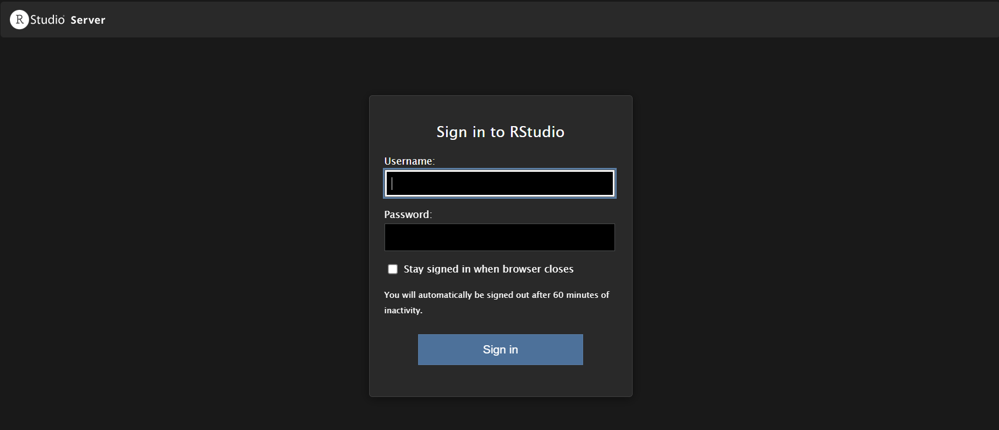
</p>

> [!IMPORTANT]
> If you try to access the server outside campus, you must be connected to the UCL VPN, otherwise the connection will not be established.

Once you manage to successfully log in the server, you shall see something like the following:

<p align="center">
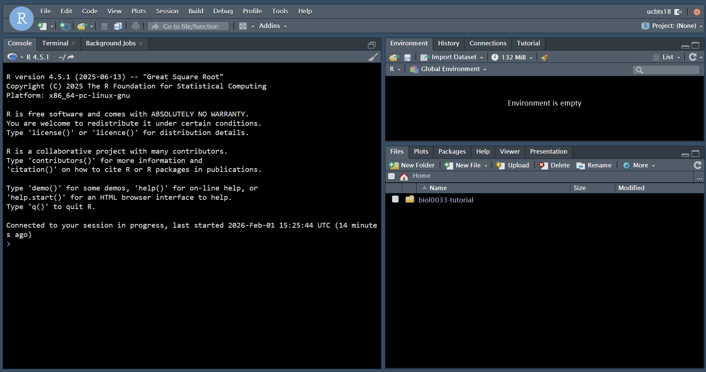
</p>

> [!TIP]
> When you first access your server, the background will be white. You can customise the background of your interface by clicking `Tools> GlobalOptions> Appearance>`. Then, you can modify the editor theme, the font size, etc. Please click `Apply` every time you want to check whether you are happy with the settings you have selected. Once everything looks fine, then press `OK` to confirm all changes.

Now, you are ready to interact with the server!

## Introducing the `Terminal` tab

While you may be familiar with loading R scripts and using the R console to run your R commands, you may have not been using the `Terminal` tab that often. Here, we will explain how you can access the directory that has been allocated for you in the server where some of the data manipulation and phylogenetic analyses will take place!

Click the `Terminal` tab that you will see next to `Console` and type the following commands as shown in the picture below:

```sh
ls
cd biol0033-tutorial/
mkdir test
ls
cd test
mkdir test
```

<p align="center">
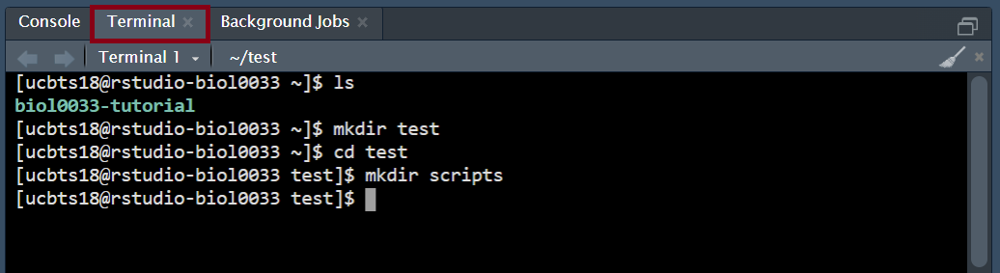
</p>

Firstly, you are listing the content of the main directory you have given access to: there is a directory called `biol0033-tutorial` where the practical sessions will take place. The file structure may change once all the data are available but, in the meantime, it looks like it is empty. We have created a new directory called `test` and, once we move inside directory `test`, we have created a new directory called `scripts`. You can see how these changes have taken place by looking at the bottom right panel under tab `Files`:

<p align="center">
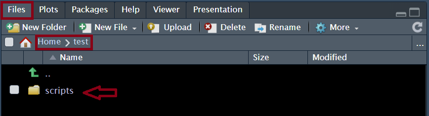
</p>

Now... Let's see what we should do if we want to upload some files from our own PC to the server!

## Uploading files to the server

We will use the bottom right panel to show you how to upload files onto the server! You can click the button `Upload` and a pop-up window will show you up: you can see the `Target directory` where the file is to be uploaded, a button `Browse` to change this directory if need be, another button `Choose File` that you can use to select the file that you want to upload, and buttons `OK` (press to confirm the upload) and `Cancel` (press to cancel the upload).

When you first try to upload a file, the target directory may be `~/biol0033-tutorial`. In our case, we will show you how to upload some scripts that we will later run, so we want to save them in the `scripts` directory we just created:

<p align="center">
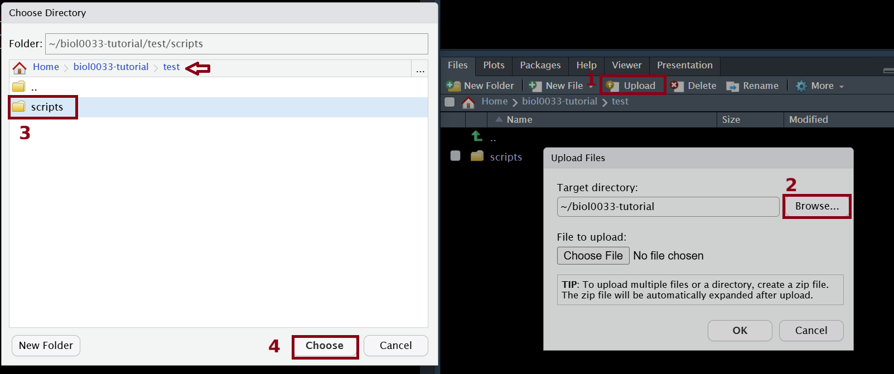
</p>

Once you press `Choose`, then you will see the path has changed:

<p align="center">

</p>

Now, let's choose the file that we want to upload! Press the button `Choose File`, navigate to the directory that has the file that you want to upload (in this example, `day1/scripts`), and select the file you want to upload (in this case, `download_ensembl_sequences.py`):

<p align="center">
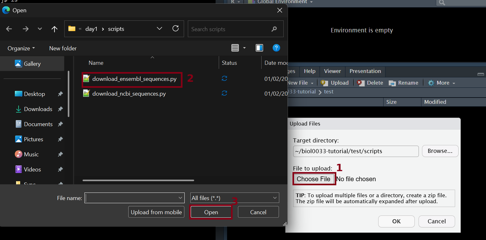
</p>

Once you find the file you want to upload, press `Open`, you will be able to see the main pop-up window updated:

<p align="center">
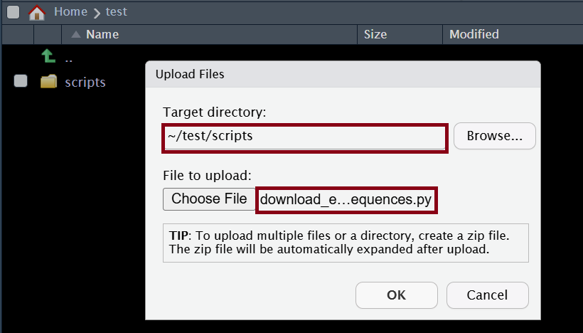
</p>

Now, if you use the bottom right panel to navigate inside `scripts`, you will see that this file has been successfully uploaded!

<p align="center">
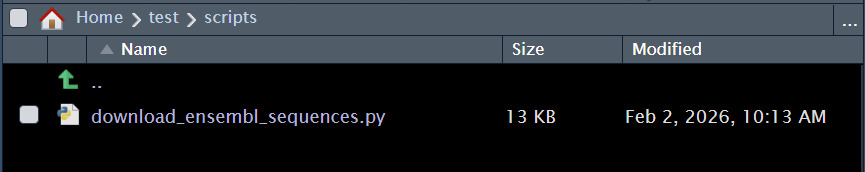
</p>

If you press the name of the script on the panel, you will be able to see the script on the top left panel -- this is very useful if you need to quickly modify a file that has already been transferred to the server!

<p align="center">
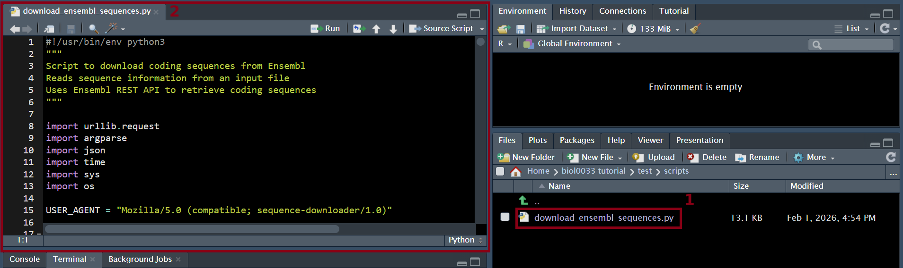
</p>

If you had run some programs on the server and you wanted to retrieve some of the output files, you would just need to click on the file you would like to download on the bottom right panel. Then, click button `More` and `Export...` as shown below:

<p align="center">
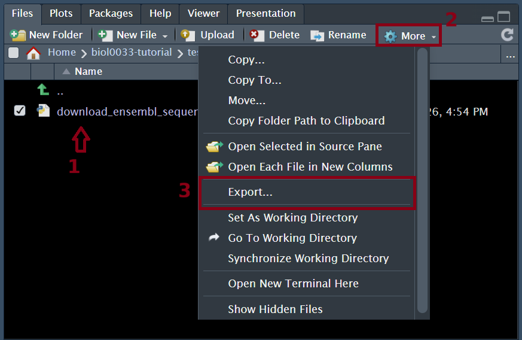
</p>

You will then need to confirm the name of the file you want to download in the next pop-up window:

<p align="center">

</p>

Lastly, you will be redirected to another tab where you can select where you want this file to be saved on your PC.

You now have learnt how to upload and download files to/from the server so... Now it is time to learn how to execute software on the server!

## Running software on the server

At the moment, we have uploaded a python script that will allow us to download some sequence data from `ENSEMBL` -- this is one of the scripts you will be using during the practical sessions! We will show you how you can execute software on a server using this python script as an example.

If you have followed all the steps abovementioned, you will have created a directory `test` and, inside this directory, another one called `scripts` (the python script was uploaded there!). Now, we will create another directory inside `test` where our input sequence data will be saved: `raw_data`. 

<p align="center">
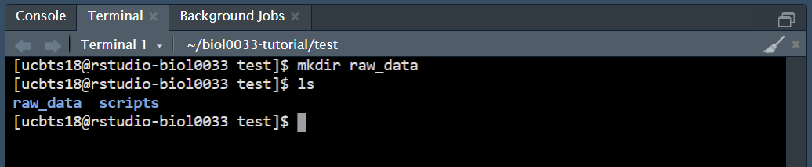
</p>

Nevertheless, we first need to upload a tab-separated file (`ensembl_sequences.py`) that we have created with the information this python script needs to download sequences from `ENSEMBL`

<p align="center">
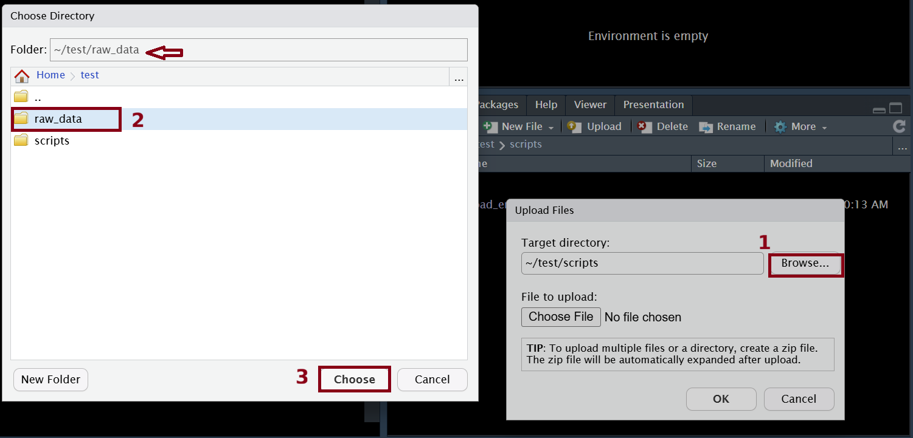
</p>
<p align="center">
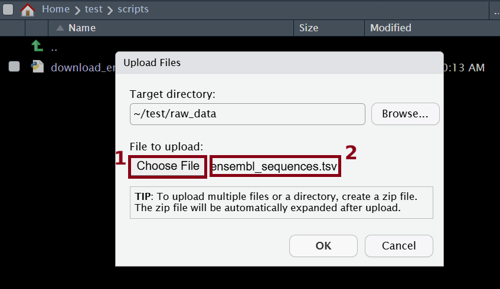
</p>

If you click this file you can see how it is structured:

* The first line is commented and has information about the content of the file
* The second line is also commented and is explaining how the content is structure: four columns separated by a tab: gene ID, the scientific name, the name to be used in the FASTA header (i.e., what is written after `>`), and the name of the output file that will be created (including the extension, `fasta`).
* The next two lines have the details required to retrieve two specific sequences of gene Mx1 for two taxa: Rhesus macaque and chimpanzee.

<p align="center">
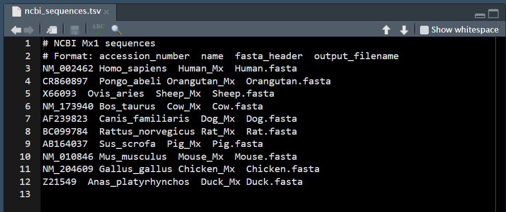
</p>

> [!NOTE]
> You can go through the python script if you want to understand how this file is parsed to obtain the required information for data download.

Now, it is time for us to run our program. Firstly, however, we will need to give permissions for this file to be executed (i.e., see command `chmod 775` in the picture below) and, once this is done, we will be able to run the program. 

<p align="center">
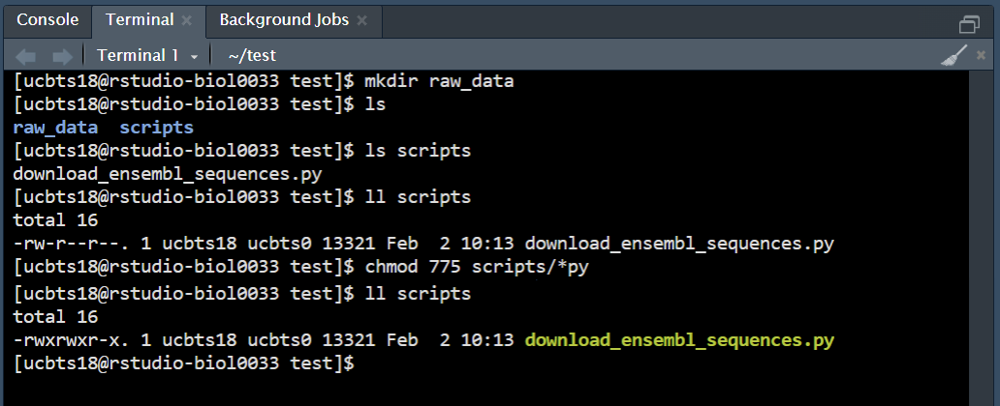
</p>

The command to execute this python script is as follows:

```sh
# To execute the python script use the following
# <path_to_script>/download_ensembl_sequences.py <path_to_tsv_file>/ensembl_sequences.tsv <path_to_outdir>/data1/ --protein --rmstop
#
##> NOTE: We enable `--protein` because we want to retrieve not only
##>       nucleotide sequences, but also amino acid seuqneces
##>       We enable `--rmstop` because we also want to obtain the
##>       nucleotide sequences without codon stops, if they had
##>       when first downloaded
scripts/download_ensembl_sequences.py raw_data/ensembl_sequences.tsv raw_data/data1/ --protein --rmstop
```

If we run this script from the `test` directory, then we need to add the path to the python script (i.e., `scripts/download_ensembl_sequences.py`) and we need to add the path to `ensembl_sequences.tsv` (i.e., `raw_data/ensembl_sequences.tsv`). In addition, we want out output directory `data1` to be inside `raw_data` because we will still need to process this data (i.e., `raw_data/data1/`). We also want to download protein sequences and remove STOP codons if any, and so we enable `--protein` and `--rmstop`:

<p align="center">
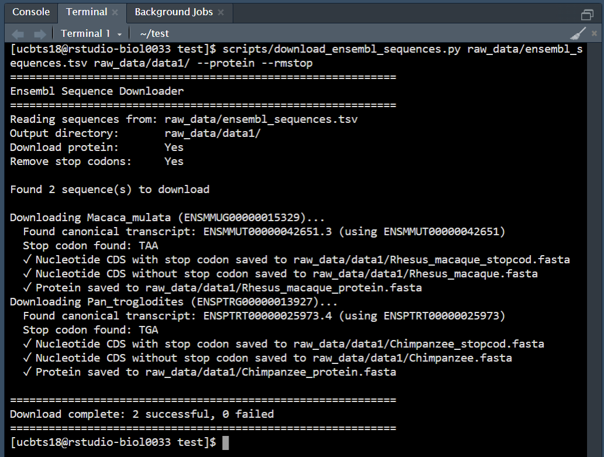
</p>

If you now use the bottom right panel to navigate to `raw_data`, you will see that a new directory `data1` has been created and has all sequence files retrieved from `ENSEMBL`:

<p align="center">
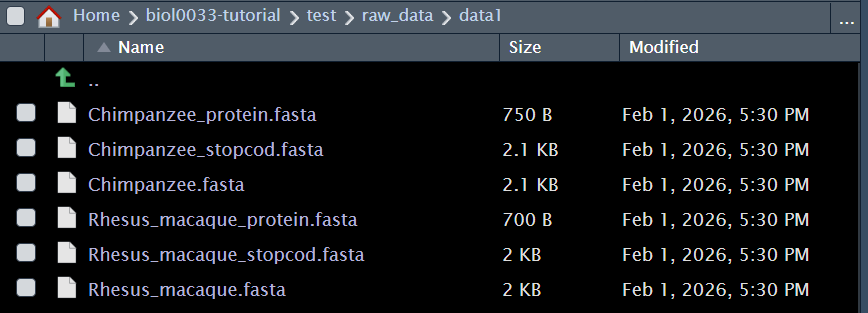
</p>